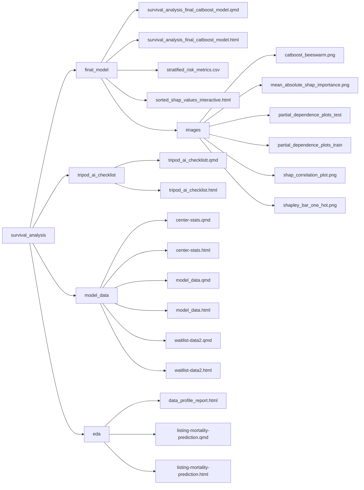

# **Survival Analysis With CatBoost**

This repository contains a comprehensive survival analysis project focusing on mortality prediction and waitlist analysis in healthcare. The project utilizes various machine learning techniques, including CatBoost, XGBoost, and Random Forest models, to analyze and predict patient outcomes.

## Project Structure

## Project Components  

### Final Model
The `final_model/` directory contains:
- The final CatBoost model for survival analysis: [survival_analysis_final_catboost_model.qmd](https://plotly-demo.s3.us-east-1.amazonaws.com/survival_analysis_final_catboost_model.html)
- Interactive Shap Values Feature Importance visualization [Shap Values](https://plotly-demo.s3.us-east-1.amazonaws.com/sorted_shap_values_interactive.html)
- Stratified Accuracy Risk Metrics
- images directory

### Images
The `images/` directory stores generated plots and figures:
- CatBoost beeswarm plot
- Mean absolute SHAP importance
- Partial dependence plots - Test and Train
- SHAP correlation plot
- Shapley bar plot (one-hot encoded)

### TRIPOD+AI Checklist
The `tripod_ai_checklist/` directory contains the completed TRIPOD+AI Checklist.  

### Model Data
The `model_data/` directory contains the data pre-processing and processing used in the analysis.
- Listing Center specific analysis
- Candidate pre-processing and candidate wait list specific analysis (censoring)
- Final Model Data Set (structure_plot.json)

### Exploratory Data Analysis (EDA)  
The `eda/` directory contains a data profiling report and initial model evaluations:
- DataExplorer dataset profile report [data_profile_report.html](https://plotly-demo.s3.us-east-1.amazonaws.com/data_profile_report.html)
- Comparison of CatBoost, XGBoost, and Random Forest models [listing-mortality-prediction.html](https://plotly-demo.s3.us-east-1.amazonaws.com/listing-mortality-prediction.html)

## Usage
To reproduce the analysis:

1. Ensure you have R and the required packages installed.
2. Request the data files and place in /data directory.
3. Run `survival_analysis_final_catboost_model.qmd`.

## Contact

[Jerome Dixon](https://www.linkedin.com/in/jeromedixon3590/)