# **Survival Analysis Dataset**

## Dataset Structure

```mermaid
graph LR
    root["root (tibble [4,523 × 73])"] --> outcome["outcome (int)"]
    root --> WL_ID_CODE["WL_ID_CODE (num)"]
    root --> AGE["AGE (num)"]
    root --> GENDER["GENDER (Factor w/ 2 levels 'F','M')"]
    root --> RACE["RACE (Factor w/ 5 levels 'Asian','Black',...)"]
    root --> WEIGHT_KG["WEIGHT_KG (num)"]
    root --> HEIGHT_CM["HEIGHT_CM (num)"]
    root --> BMI["BMI (num)"]
    root --> BSA["BSA (num)"]
    root --> ABO["ABO (Factor w/ 4 levels 'A','AB','B','O')"]
    root --> CITIZENSHIP["CITIZENSHIP (Factor w/ 3 levels 'Other','Travel for Tx',...)"]
    root --> STATUS["STATUS (Ord.factor w/ 4 levels 'Status 1A'<'Status 1B'<...)"]
    root --> LIFE_SUPPORT_CAND_REG["LIFE_SUPPORT_CAND_REG (Factor w/ 3 levels 'No','Unknown',...)"]
    root --> LIFE_SUPPORT_OTHER["LIFE_SUPPORT_OTHER (num)"]
    root --> PGE_TCR["PGE_TCR (num)"]
    root --> ECMO_CAND_REG["ECMO_CAND_REG (num)"]
    root --> VAD_CAND_REG["VAD_CAND_REG (num)"]
    root --> VAD_DEVICE_TY_TCR["VAD_DEVICE_TY_TCR (Factor w/ 5 levels 'LVAD','LVAD+RVAD',...)"]
    root --> VENTILATOR_CAND_REG["VENTILATOR_CAND_REG (num)"]
    root --> FUNC_STAT_CAND_REG["FUNC_STAT_CAND_REG (Factor w/ 12 levels 'Not Applicable (patient < 1 year old)',...)"]
    root --> WL_OTHER_ORG["WL_OTHER_ORG (Factor w/ 2 levels 'No','Yes')"]
    root --> CEREB_VASC["CEREB_VASC (Factor w/ 3 levels 'No','Unknown',...)"]
    root --> DIAB["DIAB (Factor w/ 5 levels 'None','Type I',...)"]
    root --> DIALYSIS_CAND["DIALYSIS_CAND (num)"]
    root --> HEMODYNAMICS_CO["HEMODYNAMICS_CO (num)"]
    root --> IMPL_DEFIBRIL["IMPL_DEFIBRIL (Factor w/ 3 levels 'No','Unknown',...)"]
    root --> INOTROP_VASO_CO_REG["INOTROP_VASO_CO_REG (Factor w/ 3 levels 'No','Unknown',...)"]
    root --> INOTROPES_TCR["INOTROPES_TCR (num)"]
    root --> MOST_RCNT_CREAT["MOST_RCNT_CREAT (num)"]
    root --> eGFR["eGFR (num)"]
    root --> TOT_SERUM_ALBUM["TOT_SERUM_ALBUM (num)"]
    root --> CAND_DIAG["CAND_DIAG (Factor w/ 8 levels 'Congenital Heart Disease With Surgery',...)"]
    root --> LISTING_CTR_CODE["LISTING_CTR_CODE (Factor w/ 93 levels '00124','00248',...)"]
    root --> LIST_YR["LIST_YR (num)"]
    root --> REGION["REGION (Factor w/ 11 levels '1','2','3','4',...)"]
    root --> pedhrtx_prev_yr["pedhrtx_prev_yr (num)"]
    root --> median_refusals["median_refusals (num)"]
    root --> mean_refusals["mean_refusals (num)"]
    root --> LC_effect["LC_effect (num)"]
    root --> median_wait_days["median_wait_days (num)"]
    root --> WL_DT["WL_DT (POSIXct, format)"]
    root --> PRELIM_XMATCH_REQ["PRELIM_XMATCH_REQ (Factor w/ 2 levels 'No','Yes')"]
    root --> DONCRIT_ACPT_HCVPOS["DONCRIT_ACPT_HCVPOS (Factor w/ 2 levels 'No','Yes')"]
    root --> DONCRIT_MAX_MILE["DONCRIT_MAX_MILE (num)"]
    root --> DONCRIT_MIN_WGT["DONCRIT_MIN_WGT (num)"]
    root --> DONCRIT_MAX_WGT["DONCRIT_MAX_WGT (num)"]
    root --> DONCRIT_MIN_HGT["DONCRIT_MIN_HGT (num)"]
    root --> DONCRIT_MAX_HGT["DONCRIT_MAX_HGT (num)"]
    root --> DONCRIT_MIN_AGE["DONCRIT_MIN_AGE (num)"]
    root --> DONCRIT_MAX_AGE["DONCRIT_MAX_AGE (num)"]
    root --> DONCRIT_ACPT_ABO_INCOMP["DONCRIT_ACPT_ABO_INCOMP (Factor w/ 3 levels 'No','Unknown',...)"]
    root --> DONCRIT_ACPT_HBCOREPOS["DONCRIT_ACPT_HBCOREPOS (Factor w/ 2 levels 'No','Yes')"]
    root --> DONCRIT_MIN_AGE_IMPORT["DONCRIT_MIN_AGE_IMPORT (num)"]
    root --> DONCRIT_MAX_AGE_IMPORT["DONCRIT_MAX_AGE_IMPORT (num)"]
    root --> DONCRIT_MIN_HGT_IMPORT["DONCRIT_MIN_HGT_IMPORT (num)"]
    root --> DONCRIT_MAX_HGT_IMPORT["DONCRIT_MAX_HGT_IMPORT (num)"]
    root --> DONCRIT_MIN_WGT_IMPORT["DONCRIT_MIN_WGT_IMPORT (num)"]
    root --> DONCRIT_MAX_WGT_IMPORT["DONCRIT_MAX_WGT_IMPORT (num)"]
    root --> DONCRIT_ACPT_DCD["DONCRIT_ACPT_DCD (Factor w/ 2 levels 'No','Yes')"]
    root --> DONCRIT_ACPT_HIST_CAD["DONCRIT_ACPT_HIST_CAD (Factor w/ 3 levels 'No','Unknown',...)"]
    root --> List_Yr["List_Yr (num)"]
    root --> Policy_Chg["Policy_Chg (num)"]
    root --> List_Ctr["List_Ctr (Factor w/ 89 levels 'ahbent','alfoba',...)"]
```

## Dataset Scripts  

### Center Stats
  - Listing Center specific analysis

### Waitlist Data
  - Candidate pre-processing and candidate wait list specific analysis (censoring)

### Model Data
  - Final dataset
 

### Contact [Jerome Dixon](https://www.linkedin.com/in/jeromedixon3590/) for Data Requests

