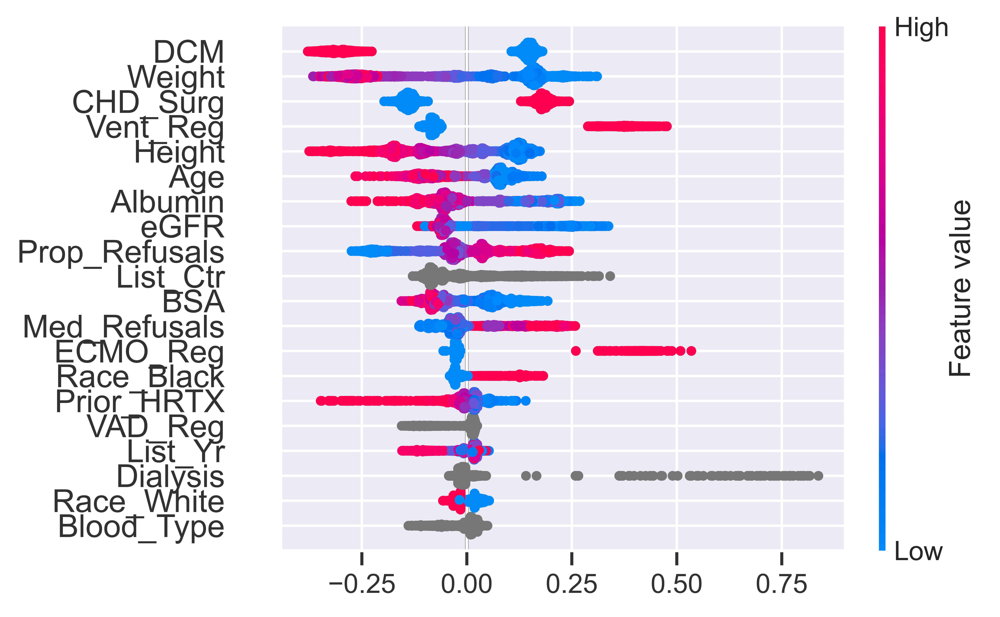
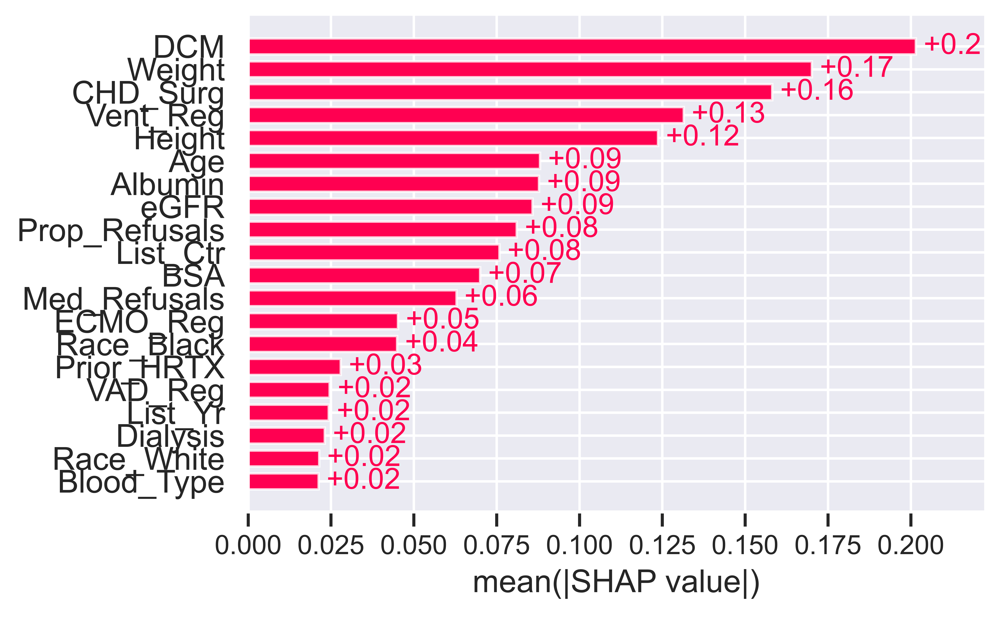
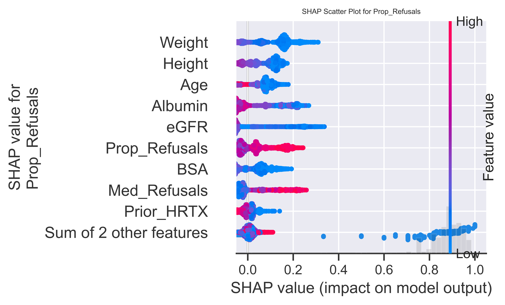
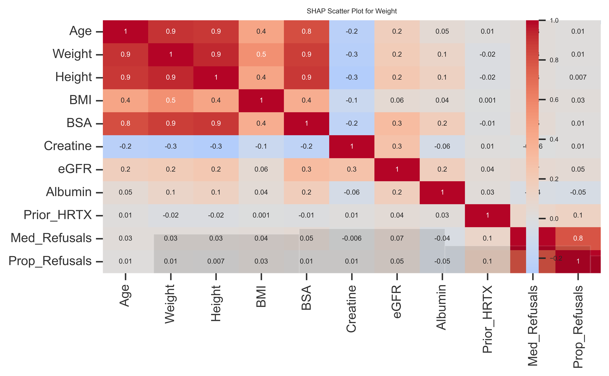

```{r load-libraries}
#| echo: true
#| warning: false
#| message: false

library(here)
library(dplyr)
library(readr)
library(magrittr)
library(spatstat)
library(tibble)
library(ggplot2)
library(purrr)
library(tidyverse)
library(huxtable)
library(reticulate)
library(DT)
library(caret)
library(forcats)
library(jsonlite)
library(quarto)
library(plotly)
library(probably)
library(pROC)
library(lubridate)
library(digest)

(options)(scipen=999)

```

### Survival Model Dataset

```{r}  

hash_numeric_string_to_letters <- Vectorize(function(input_str) {
  # Ensure the input is a numeric string
  if (!grepl("^[0-9]+$", input_str)) {
    stop("Input should be a numeric string")
  }
  
  # Hash the input string using MD5
  md5_hash <- digest(input_str, algo = "md5", serialize = FALSE)
  
  # Define the set of letters to use (lowercase a-z)
  letters <- unlist(strsplit("abcdefghijklmnopqrstuvwxyz", ""))
  
  # Convert the first 12 hex digits of the hash into a 6-letter string
  result <- c()
  for (i in seq(1, 12, by = 2)) {
    hex_value <- substr(md5_hash, i, i+1)  # Take 2 hex digits
    int_value <- strtoi(hex_value, base = 16)  # Convert hex to int
    letter_index <- (int_value %% length(letters)) + 1  # Map to one of the 26 letters
    result <- c(result, letters[letter_index])
  }
  
  # Join the list of letters into a string and return
  return(paste(result, collapse = ""))
})

```

```{r load-dataset}
#| echo: true
#| warning: false
#| message: false
#| eval: true

set.seed(1997)

survival_model <- read_rds(here("data","model_data_train.rds"))

survival_model %<>%
  mutate(
    List_Yr = as.factor(year(WL_DT)),
    Policy_Chg = if_else(as.Date(WL_DT) >= as.Date("2016-07-07"), 1, 0)
  ) %>% 
  mutate(List_Ctr = hash_numeric_string_to_letters(as.character(LISTING_CTR_CODE))) %>%
  mutate_if(is.character, as.factor) 

```

```{r}

survival_model %<>% 
  select(-median_refusals_old, -LC_effect, -mean_refusals, -WL_ID_CODE, -WL_DT, -LIST_YR, -CITIZENSHIP, -REGION, -starts_with("median_wait_days"), -starts_with("DONCRIT"), -HEMODYNAMICS_CO, -INOTROP_VASO_CO_REG, -CAND_DIAG_CODE, -CAND_DIAG_LISTING, -LIFE_SUPPORT_CAND_REG, -LIFE_SUPPORT_OTHER, -STATUS, -LISTING_CTR_CODE)


survival_model %<>%
  rename(
    Age = AGE,
    Gender = GENDER,
    Race = RACE,
    Weight = WEIGHT_KG,
    Height = HEIGHT_CM,
    BMI = BMI,
    BSA = BSA,
    Blood_Type = ABO,
    PGE_TCR = PGE_TCR,
    ECMO_Reg = ECMO_CAND_REG,
    VAD_Reg = VAD_CAND_REG,
    VAD_TCR = VAD_DEVICE_TY_TCR,
    Vent_Reg = VENTILATOR_CAND_REG,
    Status_Reg = FUNC_STAT_CAND_REG,
    WL_Oth_Org = WL_OTHER_ORG,
    Cereb_Vasc = CEREB_VASC,
    Diabetes = DIAB,
    Dialysis = DIALYSIS_CAND,
    Defib = IMPL_DEFIBRIL,
    Inotrop = INOTROPES_TCR,
    Creatine = MOST_RCNT_CREAT,
    eGFR = eGFR,
    Albumin = TOT_SERUM_ALBUM,
    Diag_Code = CAND_DIAG,
    Prior_HRTX = pedhrtx_prev_yr,
    Med_Refusals = median_refusals,
    Prop_Refusals = p_refusals,
    XMatch_Req = PRELIM_XMATCH_REQ
  )

length(colnames(survival_model))

```

```{r}
#| echo: false
#| warning: false
#| message: false
#| eval: true

survival_model_test <- read_rds(here("data","model_data_test.rds"))

survival_model_test %<>%
    mutate(
    List_Yr = as.factor(year(WL_DT)),
    Policy_Chg = if_else(as.Date(WL_DT) >= as.Date("2016-07-07"), 1, 0)
  ) %>% 
  mutate(List_Ctr = hash_numeric_string_to_letters(as.character(LISTING_CTR_CODE))) %>%
  mutate_if(is.character, as.factor) 


```

```{r}

survival_model_test %<>% 
  select(-median_refusals_old, -LC_effect, -mean_refusals, -WL_ID_CODE, -WL_DT, -LIST_YR, -CITIZENSHIP, -REGION, -starts_with("median_wait_days"), -starts_with("DONCRIT"), -HEMODYNAMICS_CO, -INOTROP_VASO_CO_REG, -CAND_DIAG_CODE, -CAND_DIAG_LISTING, -LIFE_SUPPORT_CAND_REG, -LIFE_SUPPORT_OTHER, -STATUS, -LISTING_CTR_CODE)

survival_model_test %<>%
  rename(
    Age = AGE,
    Gender = GENDER,
    Race = RACE,
    Weight = WEIGHT_KG,
    Height = HEIGHT_CM,
    BMI = BMI,
    BSA = BSA,
    Blood_Type = ABO,
    PGE_TCR = PGE_TCR,
    ECMO_Reg = ECMO_CAND_REG,
    VAD_Reg = VAD_CAND_REG,
    VAD_TCR = VAD_DEVICE_TY_TCR,
    Vent_Reg = VENTILATOR_CAND_REG,
    Status_Reg = FUNC_STAT_CAND_REG,
    WL_Oth_Org = WL_OTHER_ORG,
    Cereb_Vasc = CEREB_VASC,
    Diabetes = DIAB,
    Dialysis = DIALYSIS_CAND,
    Defib = IMPL_DEFIBRIL,
    Inotrop = INOTROPES_TCR,
    Creatine = MOST_RCNT_CREAT,
    eGFR = eGFR,
    Albumin = TOT_SERUM_ALBUM,
    Diag_Code = CAND_DIAG,
    Prior_HRTX = pedhrtx_prev_yr,
    Med_Refusals = median_refusals,
    Prop_Refusals = p_refusals,
    XMatch_Req = PRELIM_XMATCH_REQ
  )

length(colnames(survival_model))

```

```{r}

cat_features_train <- names(survival_model)[sapply(survival_model, is.factor)]

cat_features_train

```

```{r}

cat_features_test <- names(survival_model_test)[sapply(survival_model_test, is.factor)]

cat_features_test

```

#### Utility Function for Categorical Indexes

```{python}
#| echo: false
#| warning: false
#| message: false
#| eval: true

def get_categorical_indexes(X_train):
    # Select columns with object or categorical dtype
    categorical_columns = X_train.select_dtypes(include=['object', 'category'])

    # Get the column indexes of categorical variables
    categorical_indexes = [X_train.columns.get_loc(col) for col in categorical_columns]

    return categorical_indexes

```

### Native CatBoost Model

```{r}
#| echo: false
#| warning: false
#| message: false
#| eval: true

# Train
train_data <- survival_model %>% 
  select(-outcome)

# Must be factor or numeric "Class"
train_target <- survival_model %>% 
  select(outcome) %>% 
  dummify() %>% 
  as.data.frame()

train_Y <- survival_model$outcome


# Test
test_data <- survival_model_test %>% 
  select(-outcome)

# Must be factor or numeric "Class"
test_target <- survival_model_test %>% 
  select(outcome) %>% 
  dummify() %>% 
  as.data.frame()

test_Y <- survival_model_test$outcome

```

```{python catboost-r-data}

#| echo: false
#| warning: false
#| message: false

import numpy as np

# initialize Train and Test datasets
X_train = r.train_data
y_train = r.train_Y
Y_train = np.array(y_train)  

X_test = r.test_data
y_test = r.test_Y
Y_test = np.array(y_test) 

cat_index = get_categorical_indexes(X_train)
cat_index2 = get_categorical_indexes(X_test)

cat_index == cat_index2

```

```{python}
#| echo: false
#| warning: false
#| message: false

import pandas as pd

# Convert NaN values to a string in categorical columns
categorical_columns = [col for col in X_train.columns if X_train[col].dtype == 'object']
X_train[categorical_columns] = X_train[categorical_columns].fillna('missing')


# Convert NaN values to a string in categorical columns
categorical_columns = [col for col in X_test.columns if X_test[col].dtype == 'object']
X_test[categorical_columns] = X_test[categorical_columns].fillna('missing')

```

-   Data Cleansing for Missing Values

```{python}
#| echo: false
#| warning: false
#| message: false

# NaN values in the column at index 15
has_nan = X_train.iloc[:, 11].isna().any()
print("Column at index 11 contains NaN values:", has_nan)

```
 
 - Clean/Fix index 11
 
```{python}
#| echo: false
#| warning: false
#| message: false

if 'Missing' not in X_train.iloc[:, 11].cat.categories:
    X_train.iloc[:, 11] = X_train.iloc[:, 11].cat.add_categories(['Missing'])

# Replace NaN values in the column at index 15 with "Missing"
X_train.iloc[:, 11] = X_train.iloc[:, 11].fillna('Missing')

```

#### Optuna Hyperparameter Optimization

```{python optuna-native-model, eval=FALSE}

#| eval: false
#| echo: false
#| warning: false
#| message: false

import numpy as np
import pandas as pd
from sklearn.model_selection import train_test_split
import catboost as cb
from catboost import Pool
from catboost.utils import eval_metric
import optuna


def objective(trial):
    # Parameter suggestions
    params = {
        "objective": "Logloss",
        "iterations": 1000,
        "early_stopping_rounds": 50,
        "use_best_model": False,
        "eval_metric":"AUC",
        "learning_rate": trial.suggest_float("learning_rate", 0.01, 0.3),
        "depth": trial.suggest_int("depth", 1, 9),
        "colsample_bylevel": trial.suggest_float("colsample_bylevel", 0.05, 1.0),
        "min_data_in_leaf": trial.suggest_int("min_data_in_leaf", 1, 100),
        "l2_leaf_reg": trial.suggest_float("l2_leaf_reg", 1, 12),
        "boosting_type": "Ordered",
        "bootstrap_type": "MVS",
        "verbose": 0  # Controlling verbose output
    }

    model = cb.CatBoostClassifier(**params)
    train_pool = cb.Pool(X_train, Y_train, cat_features=get_categorical_indexes(X_train))
    cv_results = cb.cv(train_pool, params, fold_count=3, seed=3590, stratified=True, verbose=False, plot=False)
    return np.max(cv_results['test-AUC-mean'])

study = optuna.create_study(direction="maximize")
study.optimize(objective, n_trials=50, timeout=6000)

print("Number of finished trials: {}".format(len(study.trials)))
print("Best trial:")
for key, value in study.best_trial.params.items():
    print("  {}: {}".format(key, value))


```

-   Best is trial #23/50 with value: 0.737

```{python optuna-params1}

model_params_native = {
    'learning_rate': 0.06,
    'depth': 8,
    'colsample_bylevel': 0.32,
    'min_data_in_leaf': 7,
    'l2_leaf_reg': 4.9
}
    
```

#### Model

```{python catboost-model-auc}

#| eval: true
#| echo: true
#| message: false
#| warning: false

import numpy as np
from sklearn.model_selection import train_test_split, StratifiedKFold
import pandas as pd
import optuna
from catboost import CatBoostClassifier, Pool


model_auc = CatBoostClassifier(objective='Logloss',
                               iterations=1000,
                               eval_metric="AUC",
                               **model_params_native, 
                               boosting_type='Ordered',
                               bootstrap_type='MVS',
                               metric_period=25,
                               early_stopping_rounds=100,
                               use_best_model=False, 
                               random_seed=1997)

# Create a Pool object for the training and testing data
train_pool = Pool(X_train, cat_features=cat_index, label=Y_train)
test_pool = Pool(X_test, cat_features=cat_index, label=Y_test)
 

model_auc.fit(train_pool, eval_set=test_pool)

```

#### Calibration Plot

```{python}

import pandas as pd

Y_Pred = model_auc.predict(X_test)
Y_Pred_Proba = model_auc.predict_proba(X_test)[:, 1]  # get the probabilities of the positive class


Y_Pred_Proba_Positive = model_auc.predict_proba(X_test)[:, 1]  # Probabilities of the positive class
Y_Pred_Proba_Negative = model_auc.predict_proba(X_test)[:, 0]  # Probabilities of the negative class

# Converting predictions and actuals into a DataFrame for better readability, including negative class probabilities
predictions = pd.DataFrame({
    'Prob_Negative_Class': Y_Pred_Proba_Negative,
    'Prob_Positive_Class': Y_Pred_Proba_Positive,
    'Predicted': Y_Pred,
    'Actual': Y_test
})

```


```{r}

predictions <- py$predictions %>% 
  mutate(Class = ifelse(Actual == 0, "survive", "not_survive"),
         .pred_not_survive = Prob_Positive_Class
         )

# Define the levels you want
factor_levels <- c("survive", "not_survive")

# Set the levels of the 'actuals' column
predictions$Class <- factor(predictions$Class, levels = rev(factor_levels))

predictions %>% 
  cal_plot_logistic(Class, .pred_not_survive)

```

#### Decision Threshold

```{r message=FALSE, warning=FALSE}

# Calculate the ROC curve
roc_result <- roc(predictions$Actual, predictions$Prob_Positive_Class)

coords <- coords(roc_result, "best", ret="threshold", best.method="closest.topleft")

# Optimal threshold for maximizing true positive rate
optimal_threshold <- coords$threshold

# Apply the optimal threshold to convert probabilities to class predictions
predictions$predicted_classes <- ifelse(predictions$Prob_Positive_Class >= optimal_threshold, 1, 0)

# Output the optimal threshold
cat("Optimal Threshold:", optimal_threshold, "\n")

cat("Number of '1's predicted:", sum(predictions$predicted_classes), "\n")

```

#### Calibrated Model Metrics

```{python}

from sklearn.metrics import (
    roc_auc_score, 
    brier_score_loss, 
    accuracy_score, 
    log_loss, 
    f1_score, 
    precision_score, 
    recall_score, 
    average_precision_score, 
    confusion_matrix
)
import pandas as pd


Y_Pred_Proba_Positive = model_auc.predict_proba(X_test)[:, 1]  # Probabilities of the positive class
Y_Pred = r.predictions["predicted_classes"]  # Calibrated predictions from R

# Calculate AUC (using probabilities)
auc = roc_auc_score(Y_test, Y_Pred_Proba_Positive)

# Calculate Brier Score (using probabilities)
brier_score = brier_score_loss(Y_test, Y_Pred_Proba_Positive)

# Calculate Accuracy (using binary predictions)
accuracy = accuracy_score(Y_test, Y_Pred)

# Calculate Log Loss (using probabilities)
log_loss_value = log_loss(Y_test, Y_Pred_Proba_Positive)

# Calculate F1 Score (using binary predictions)
f1 = f1_score(Y_test, Y_Pred)

# Calculate Precision (using binary predictions)
precision = precision_score(Y_test, Y_Pred)

# Calculate Recall (using binary predictions)
recall = recall_score(Y_test, Y_Pred)

# Calculate AUPR (using probabilities)
aupr = average_precision_score(Y_test, Y_Pred_Proba_Positive)

# Calculate Confusion Matrix (using binary predictions)
conf_matrix = confusion_matrix(Y_test, Y_Pred)

# Extract TN, FP, FN, TP from the confusion matrix
tn, fp, fn, tp = conf_matrix.ravel()

# Create a DataFrame with all metrics
catboost_metrics_native = pd.DataFrame({
    'Model': ['Native_Catboost'],
    'AUC': [auc],  # AUC remains the same as it uses probabilities
    'Brier Score': [brier_score],  # Brier Score uses probabilities
    'Accuracy': [accuracy],  # Accuracy uses binary predictions
    'Log Loss': [log_loss_value],  # Log Loss uses probabilities
    'F1 Score': [f1],  # F1 Score uses binary predictions
    'Precision': [precision],  # Precision uses binary predictions
    'Recall': [recall],  # Recall uses binary predictions
    'AUPR': [aupr],  # AUPR uses probabilities
    'True Negative (TN)': [tn],  # Extracted TN
    'False Positive (FP)': [fp],  # Extracted FP
    'False Negative (FN)': [fn],  # Extracted FN
    'True Positive (TP)': [tp]  # Extracted TP
})

print(catboost_metrics_native)

```

#### Feature Importance

```{python}

gain = model_auc.get_feature_importance(prettified=True)
loss = model_auc.get_feature_importance(test_pool, type='LossFunctionChange', prettified=True)

```

```{r catboost-native-feature-importance}
#| echo: false
#| layout-ncol: 1
#| label: tbl-feature-importance-native
#| tbl-cap: "CatBoost Feature Importance"
#| tbl-subcap: 
#|   - "Gain"
#|   - "Loss Function Change"
#| warning: false
#| message: false
#| eval: true

gain_tbl1 <- py$gain

gain_table1 <- tibble( 'Feature ID' = gain_tbl1$`Feature Id`,
                  'Importance' = gain_tbl1$Importances) %>% 
  rowid_to_column(var = "Rank") %>% 
  as_hux() %>%
  theme_article() %>% 
  set_align(col=c('Rank','Importance'), value= "center") %>% 
  set_tb_padding(2)

loss_tbl1 <- py$loss

loss_table1 <- tibble( 'Feature ID' = loss_tbl1$`Feature Id`,
                  'Importance' = loss_tbl1$Importances) %>% 
  rowid_to_column(var = "Rank") %>% 
  as_hux() %>%
  theme_article() %>% 
  set_align(col=c('Rank','Importance'), value= "center") %>% 
  set_tb_padding(2)


gain_table1
loss_table1

```

### CatBoost with One Hot Encoding For Key Variables - Hybrid Model

- Train

```{r}
one_hot_hybrid <- survival_model
```

```{r}

cat_features <- names(one_hot_hybrid)[sapply(one_hot_hybrid, is.factor)]

cat_features

```

```{r}
hybrid_cat <- cat_features[c(2,12)]

hybrid_cat
```

```{r}

# Create the dummy variables specification
dummies <- dummyVars(~ ., data = one_hot_hybrid[, hybrid_cat], fullRank = FALSE)

# Generate the dummy variables
df_dummies <- predict(dummies, newdata = one_hot_hybrid)

# Bind the new dummy variables with the original dataframe minus the original factor columns
one_hot_hybrid <- cbind(one_hot_hybrid[, !(names(one_hot_hybrid) %in% hybrid_cat)], df_dummies)

# Review the structure of the updated dataframe
str(one_hot_hybrid)

```


```{r}


one_hot_hybrid %<>%
  rename(
    CHD_Surg = `Diag_Code.Congenital Heart Disease With Surgery`,
    CHD_NoSurg = `Diag_Code.Congenital Heart Disease Without Surgery`,
    DCM = `Diag_Code.Dilated Cardiomyopathy`,
    HCM = `Diag_Code.Hypertrophic Cardiomyopathy`,
    Myocard = Diag_Code.Myocarditis,
    Other_Diag = Diag_Code.Other,
    RCM = `Diag_Code.Restrictive Cardiomyopathy`,
    VHD = `Diag_Code.Valvular Heart Disease`
  ) 

# Replace any spaces or dots in column names with underscores
names(one_hot_hybrid) <- gsub("[ .]", "_", names(one_hot_hybrid))

# Review the structure of the updated dataframe
str(one_hot_hybrid)

```

- Test

```{r}
one_hot_hybrid_test <- survival_model_test
```

```{r}

cat_features <- names(one_hot_hybrid_test)[sapply(one_hot_hybrid_test, is.factor)]

cat_features

```

```{r}

hybrid_cat <- cat_features[c(2,12)]

hybrid_cat

```

```{r}

# Create the dummy variables specification
dummies <- dummyVars(~ ., data = one_hot_hybrid_test[, hybrid_cat], fullRank = FALSE)

# Generate the dummy variables
df_dummies <- predict(dummies, newdata = one_hot_hybrid_test)

# Bind the new dummy variables with the original dataframe minus the original factor columns
one_hot_hybrid_test <- cbind(one_hot_hybrid_test[, !(names(one_hot_hybrid_test) %in% hybrid_cat)], df_dummies)

# Review the structure of the updated dataframe
str(one_hot_hybrid_test)


```

```{r}

one_hot_hybrid_test %<>%
 rename(
    CHD_Surg = `Diag_Code.Congenital Heart Disease With Surgery`,
    CHD_NoSurg = `Diag_Code.Congenital Heart Disease Without Surgery`,
    DCM = `Diag_Code.Dilated Cardiomyopathy`,
    HCM = `Diag_Code.Hypertrophic Cardiomyopathy`,
    Myocard = Diag_Code.Myocarditis,
    Other_Diag = Diag_Code.Other,
    RCM = `Diag_Code.Restrictive Cardiomyopathy`,
    VHD = `Diag_Code.Valvular Heart Disease`
  ) 

# Replace any spaces or dots in column names with underscores
names(one_hot_hybrid_test) <- gsub("[ .]", "_", names(one_hot_hybrid_test))

# Review the structure of the updated dataframe
str(one_hot_hybrid_test)

```

### Hybrid OHE CatBoost Model

```{r}
#| echo: false
#| warning: false
#| message: false
#| eval: true

# Train
hybrid_train_data <- one_hot_hybrid %>% 
  select(-outcome)

# Must be factor or numeric "Class"
hybrid_train_target <- one_hot_hybrid %>% 
  select(outcome) %>% 
  dummify() %>% 
  as.data.frame()

hybrid_train_Y <- one_hot_hybrid$outcome


# Test
hybrid_test_data <- one_hot_hybrid_test %>% 
  select(-outcome)

# Must be factor or numeric "Class"
hybrid_test_target <- one_hot_hybrid_test %>% 
  select(outcome) %>% 
  dummify() %>% 
  as.data.frame()

hybrid_test_Y <- one_hot_hybrid_test$outcome

```

```{python catboost-r-data-hybrid}

#| echo: false
#| warning: false
#| message: false

import numpy as np

# initialize Train and Test datasets
hybrid_X_train = r.hybrid_train_data
hybrid_y_train = r.hybrid_train_Y
hybrid_Y_train = np.array(hybrid_y_train)  

hybrid_X_test = r.hybrid_test_data
hybrid_y_test = r.hybrid_test_Y
hybrid_Y_test = np.array(hybrid_y_test) 

hybrid_cat_index = get_categorical_indexes(hybrid_X_train)

```

```{python}
#| echo: false
#| warning: false
#| message: false


import pandas as pd
import numpy as np

# Function to clean invalid values in both numeric and categorical columns
def clean_invalid_values(df):
    for col in df.columns:
        if pd.api.types.is_numeric_dtype(df[col]):
            # For numeric columns, replace inf with NaN, then replace NaN with 0
            df[col] = df[col].replace([np.inf, -np.inf], np.nan)  # Replace inf values with NaN
            df[col] = df[col].fillna(0)  # Replace NaN with 0
        else:
            # For categorical columns, replace NaN with 'Missing'
            if isinstance(df[col].dtype, pd.CategoricalDtype):
                # Add 'Missing' as a new category if it's not already in the categories
                df[col] = df[col].cat.add_categories(['Missing']).fillna('Missing')
            else:
                # If it's not categorical yet, just replace NaN with 'Missing'
                df[col] = df[col].fillna('Missing')
            print(f"Processed non-numeric column: {col}")
    return df


# Clean hybrid_X_train and hybrid_X_test by replacing invalid values with zero or 'Missing'
hybrid_X_train_cleaned = clean_invalid_values(pd.DataFrame(hybrid_X_train))
hybrid_X_test_cleaned = clean_invalid_values(pd.DataFrame(hybrid_X_test))


```

#### Optuna Hyperparameter Optimization

```{python optuna-one-hot-hybrid, eval=FALSE}

#| eval: false
#| echo: false
#| warning: false
#| message: false

import numpy as np
from sklearn.model_selection import train_test_split
import pandas as pd
import catboost as cb
from catboost.utils import eval_metric
import optuna


def objective(trial):
    # Parameter suggestions
    params = {
        "objective": "Logloss",
        "iterations": 1000,
        "early_stopping_rounds": 50,
        "use_best_model": False,
        "eval_metric":"AUC",
        "learning_rate": trial.suggest_float("learning_rate", 0.01, 0.3),
        "depth": trial.suggest_int("depth", 1, 9),
        "colsample_bylevel": trial.suggest_float("colsample_bylevel", 0.05, 1.0),
        "min_data_in_leaf": trial.suggest_int("min_data_in_leaf", 1, 100),
        "l2_leaf_reg": trial.suggest_float("l2_leaf_reg", 1, 12),
        "boosting_type": "Ordered",
        "bootstrap_type": "MVS",
        "early_stopping_rounds": 100
    }

    model = cb.CatBoostClassifier(**params)
    train_pool = cb.Pool(hybrid_X_train, hybrid_Y_train, cat_features=get_categorical_indexes(hybrid_X_train))
    cv_results = cb.cv(train_pool, params, fold_count=3, seed=3590, stratified=True, verbose=False)
    return np.max(cv_results['test-AUC-mean'])

study = optuna.create_study(direction="maximize")
study.optimize(objective, n_trials=50, timeout=6000)

print("Number of finished trials: {}".format(len(study.trials)))
print("Best trial:")
for key, value in study.best_trial.params.items():
    print("  {}: {}".format(key, value))


```

#### Model

-   From Optuna Trial #43/50 with value: 0.738

```{python optuna-params3}

model_params_hybrid = {
    'learning_rate': 0.07,
    'depth': 4,
    'colsample_bylevel': 0.11,
    'min_data_in_leaf': 82,
    'l2_leaf_reg': 7.03
}
    
```

```{python catboost-model-one-hot-hybrid}

#| eval: true
#| echo: true
#| message: false
#| warning: false

from sklearn.model_selection import train_test_split
from catboost import CatBoostClassifier, Pool

cat_indexes = get_categorical_indexes(hybrid_X_train_cleaned)

hybrid_model = CatBoostClassifier(
                               objective='Logloss',
                               iterations=1000,
                               eval_metric='AUC',
                               **model_params_hybrid, 
                               boosting_type= 'Ordered',
                               metric_period=500,
                               bootstrap_type='MVS',
                               early_stopping_rounds=50,
                               use_best_model=False, 
                               random_seed=1997)
                               

# Create a Pool object for the training and testing data
train_pool = Pool(hybrid_X_train_cleaned, cat_features=cat_indexes, label=hybrid_Y_train)
test_pool = Pool(hybrid_X_test_cleaned, cat_features=cat_indexes, label=hybrid_Y_test)

hybrid_model.fit(train_pool, eval_set=test_pool)

gain_hybrid = hybrid_model.get_feature_importance(prettified=True)
loss_hybrid = hybrid_model.get_feature_importance(test_pool, type='LossFunctionChange', prettified=True)

```
#### Calibration Plot

```{python}

import pandas as pd

Y_Pred_hybrid = hybrid_model.predict(hybrid_X_test)
Y_Pred_Proba_hybrid = hybrid_model.predict_proba(hybrid_X_test)[:, 1]  # get the probabilities of the positive class


Y_Pred_Proba_Positive_hybrid = hybrid_model.predict_proba(hybrid_X_test)[:, 1]  # Probabilities of the positive class
Y_Pred_Proba_Negative_hybrid = hybrid_model.predict_proba(hybrid_X_test)[:, 0]  # Probabilities of the negative class

# Converting predictions and actuals into a DataFrame for better readability, including negative class probabilities
hybrid_predictions = pd.DataFrame({
    'Prob_Negative_Class': Y_Pred_Proba_Negative_hybrid,
    'Prob_Positive_Class': Y_Pred_Proba_Positive_hybrid,
    'Predicted': Y_Pred_hybrid,
    'Actual': hybrid_y_test
})

```


```{r}

hybrid_predictions <- py$hybrid_predictions %>% 
  mutate(Class = ifelse(Actual == 0, "survive", "not_survive"),
         .pred_not_survive = Prob_Positive_Class
         )

# Define the levels you want
factor_levels <- c("survive", "not_survive")

# Set the levels of the 'actuals' column
hybrid_predictions$Class <- factor(hybrid_predictions$Class, levels = rev(factor_levels))

hybrid_predictions %>% 
  cal_plot_logistic(Class, .pred_not_survive)

```

#### Decision Threshold

```{r message=FALSE, warning=FALSE}

# Calculate the ROC curve
hybrid_roc_result <- roc(hybrid_predictions$Actual, hybrid_predictions$Prob_Positive_Class)

hybrid_coords <- coords(hybrid_roc_result, "best", ret="threshold", best.method="closest.topleft")

# Optimal threshold for maximizing true positive rate
hybrid_optimal_threshold <- hybrid_coords$threshold

# Apply the optimal threshold to convert probabilities to class predictions
hybrid_predictions$predicted_classes <- ifelse(hybrid_predictions$Prob_Positive_Class >= optimal_threshold, 1, 0)

# Output the optimal threshold
cat("Optimal Threshold:", hybrid_optimal_threshold, "\n")

cat("Number of '1's predicted:", sum(hybrid_predictions$predicted_classes), "\n")

```
#### Calibrated Model Metrics

```{python}

from sklearn.metrics import (
    roc_auc_score, 
    brier_score_loss, 
    accuracy_score, 
    log_loss, 
    f1_score, 
    precision_score, 
    recall_score, 
    average_precision_score, 
    confusion_matrix
)
import pandas as pd


Y_Pred_Proba_Positive_hybrid = hybrid_model.predict_proba(hybrid_X_test)[:, 1]  # Probabilities of the positive class
Y_Pred_hybrid = r.hybrid_predictions["predicted_classes"]  # Calibrated predictions from R

# Calculate AUC (using probabilities)
auc_hybrid = roc_auc_score(hybrid_y_test, Y_Pred_Proba_Positive_hybrid)

# Calculate Brier Score (using probabilities)
brier_score_hybrid = brier_score_loss(hybrid_y_test, Y_Pred_Proba_Positive_hybrid)

# Calculate Accuracy (using binary predictions)
accuracy_hybrid = accuracy_score(hybrid_y_test, Y_Pred_hybrid)

# Calculate Log Loss (using probabilities)
log_loss_value_hybrid = log_loss(hybrid_y_test, Y_Pred_Proba_Positive_hybrid)

# Calculate F1 Score (using binary predictions)
f1_hybrid = f1_score(hybrid_y_test, Y_Pred_hybrid)

# Calculate Precision (using binary predictions)
precision_hybrid = precision_score(hybrid_y_test, Y_Pred_hybrid)

# Calculate Recall (using binary predictions)
recall_hybrid = recall_score(hybrid_y_test, Y_Pred_hybrid)

# Calculate AUPR (using probabilities)
aupr_hybrid = average_precision_score(hybrid_y_test, Y_Pred_Proba_Positive_hybrid)

# Calculate Confusion Matrix (using binary predictions)
conf_matrix_hybrid = confusion_matrix(hybrid_y_test, Y_Pred_hybrid)

# Extract TN, FP, FN, TP from the confusion matrix
tn_hybrid, fp_hybrid, fn_hybrid, tp_hybrid = conf_matrix_hybrid.ravel()

# Create a DataFrame with all metrics
catboost_metrics_hybrid = pd.DataFrame({
    'Model': ['Hybrid_Catboost'],
    'AUC': [auc_hybrid],  # AUC remains the same as it uses probabilities
    'Brier Score': [brier_score_hybrid],  # Brier Score uses probabilities
    'Accuracy': [accuracy_hybrid],  # Accuracy uses binary predictions
    'Log Loss': [log_loss_value_hybrid],  # Log Loss uses probabilities
    'F1 Score': [f1_hybrid],  # F1 Score uses binary predictions
    'Precision': [precision_hybrid],  # Precision uses binary predictions
    'Recall': [recall_hybrid],  # Recall uses binary predictions
    'AUPR': [aupr_hybrid],  # AUPR uses probabilities
    'True Negative (TN)': [tn_hybrid],  # Extracted TN
    'False Positive (FP)': [fp_hybrid],  # Extracted FP
    'False Negative (FN)': [fn_hybrid],  # Extracted FN
    'True Positive (TP)': [tp_hybrid]  # Extracted TP
})

print(catboost_metrics_hybrid)

```

#### Final Feature Importance: One Hot Hybrid Model

```{r feature-importance-one-hot}
#| echo: false
#| layout-ncol: 1
#| label: tbl-feature-importance-one-hot
#| tbl-cap: "CatBoost Feature Importance with Hybrid One-Hot Encoding"
#| tbl-subcap: 
#|   - "Gain"
#|   - "Loss Function Change"
#| warning: false
#| message: false
#| eval: true

gain_tbl_ohe <- py$gain_hybrid
loss_tbl_ohe <- py$loss_hybrid

gain_table_ohe <- tibble( 'Feature ID' = gain_tbl_ohe$`Feature Id`,
                  'Importance' = gain_tbl_ohe$Importances) %>% 
  rowid_to_column(var = "Rank") %>% 
  as_hux() %>%
  theme_article() %>% 
  set_align(col=c('Rank','Importance'), value= "center") %>% 
  set_tb_padding(2)


loss_table_ohe <- tibble( 'Feature ID' = loss_tbl_ohe$`Feature Id`,
                  'Importance' = loss_tbl_ohe$Importances) %>% 
  rowid_to_column(var = "Rank") %>% 
  as_hux() %>%
  theme_article() %>% 
  set_align(col=c('Rank','Importance'), value= "center") %>% 
  set_tb_padding(2)

gain_table_ohe
loss_table_ohe

```
#### Interactions

```{python}

# Extract feature names from the training pool
columns_feature = train_pool.get_feature_names()

model_interactions = hybrid_model.get_feature_importance(data=train_pool, type="Interaction", prettified=True)

# Added the feature names for ease of checking
model_interactions["First Feature"] = model_interactions["First Feature Index"].apply(lambda x: columns_feature[x])
model_interactions["Second Feature"] = model_interactions["Second Feature Index"].apply(lambda x: columns_feature[x])


```

```{r}
model_interactions <- py$model_interactions

model_interactions %<>% 
  select(4,5,3)

model_interactions
```


### CatBoost Model Accuracy Summary

```{r}
#| echo: false
#| warning: false
#| message: false

final_model_accuracy_metrics <- rbind(py$catboost_metrics_native, py$catboost_metrics_hybrid )


model_accuracy <- final_model_accuracy_metrics[1:9]

model_confusion_matrix <- final_model_accuracy_metrics[c(1,10:13)]

```

```{r}

model_accuracy

```

```{r}
model_confusion_matrix
```


### SHAP Value Analysis for Hybrid Model - Slight loss in accuracy but more explainable to the feature level and higher Recall.

```{python shap-setup}

#| eval: true
#| echo: false
#| message: false
#| warning: false

import shap

explainer = shap.TreeExplainer(hybrid_model)
shap_values = explainer(hybrid_X_train_cleaned)

```

#### Beeswarm (Top Features - Categorical and Numerical)

```{python}
#| eval: true
#| echo: false
#| message: false
#| warning: false

mean_abs_shap_values = np.mean(np.abs(shap_values.values), axis=0)

top_n = 20
top_indices = np.argsort(-mean_abs_shap_values)[:top_n]  # Indices of the top features

# filtered SHAP object with top N features
filtered_shap_values = shap.Explanation(
    shap_values.values[:, top_indices],
    base_values=shap_values.base_values,
    data=shap_values.data[:, top_indices],
    feature_names=np.array(shap_values.feature_names)[top_indices]
)


```

```{python shap-beeswarm}
#| eval: false
#| echo: false
#| message: false
#| warning: false


import matplotlib.pyplot as plt
import shap

plt.close()


shap.plots.beeswarm(filtered_shap_values, max_display=top_n)

plt.xlabel('', fontsize=8)
plt.ylabel('', fontsize=8)
plt.title('', fontsize=8)
plt.tight_layout()

plt.savefig('images/shapley_beeswarm.png', dpi=1200)

plt.close()


```

{#fig-shap-beeswarm-chart}

#### Bar Chart for Feature Importance

```{python shapley-bar-chart}
#| eval: false
#| echo: false
#| warning: false
#| message: false
#| label: fig-net-effect
#| fig-cap: 
#|   - "Net Effect"

import matplotlib.pyplot as plt
import shap

plt.close()

shap.initjs()

shap.plots.bar(filtered_shap_values, max_display=20)

plt.tight_layout()

# Save the image in high resolution
plt.savefig('images/shapley_bar_one_hot.png', dpi=1200)

plt.close()


```

{#fig-shap-bar-chart}

```{python}
#| eval: true
#| echo: false
#| warning: false
#| message: false


# Get the list of all columns
all_columns = hybrid_X_train_cleaned.columns.tolist()

# Function to check if a column is one-hot encoded
def is_one_hot_encoded(column):
    unique_values = hybrid_X_train_cleaned[column].unique()
    return set(unique_values).issubset({0, 1}) and len(unique_values) <= 2

# Select numerical features that are not one-hot encoded
num_features = [col for col in all_columns if hybrid_X_train_cleaned[col].dtype in ['int64', 'float64'] and not is_one_hot_encoded(col)]
print("Numerical Features:", num_features)

# Get the indices of numerical features
num_feature_indices = [hybrid_X_train_cleaned.columns.get_loc(col) for col in num_features]
print("Indices of Numerical Features:", num_feature_indices)


```

#### Beeswarm Top Numerical Features

```{python beeswarm-numerical-features}
#| eval: false
#| echo: false
#| warning: false
#| message: false
#| out-width: 70%
#| out-height: 70%
#| fig-cap: 
#|   - "Beeswarm Numerical Effects"

import matplotlib.pyplot as plt
import shap
import pickle

shap.initjs()

plt.close()


# Subset the SHAP values to only include the numerical features
numerical_shap_values = shap_values[:, num_feature_indices]

# Plot the beeswarm for only the numerical features
shap.plots.beeswarm(numerical_shap_values)

plt.tight_layout()

# Save the figure with desired DPI
plt.savefig('images/shapley_beeswarm_numerical.png', dpi=1200, bbox_inches="tight")

plt.close()


```

{#fig-shap-numerical-beeswarm-chart}

#### Feature Importance Correlation Plot

```{python correlation-plot}
#| eval: false
#| echo: false
#| warning: false
#| message: false
#| out-width: 70%
#| out-height: 70%
#| fig-cap: 
#|   - "SHAP Value Correlation Plot"

plt.close()

import seaborn as sns
import matplotlib.pyplot as plt

# SHAP correlation plot
corr_matrix = pd.DataFrame(numerical_shap_values.values, columns=num_features).corr()

sns.set(font_scale=.5)
sns.heatmap(corr_matrix,cmap="coolwarm", center=0, annot=True, fmt =".1g")

plt.tight_layout()

# Save the figure with desired DPI
plt.savefig('images/shap_correlation_plot.png', dpi=1200, bbox_inches="tight")

plt.close()


```

{#fig-shap-correlation-plot}

#### Feature Importance - Mean Absolute Value

```{r shap-values}
#| echo: false
#| warning: false
#| message: false
#| eval: true

# SHAP values
shap_values <- py$shap_values

# Extract SHAP values for each feature (excluding the last column which is the expected value)
shap_values_matrix <- shap_values$values

# Convert SHAP values to a dataframe for easier analysis
shap_df <- as.data.frame(shap_values_matrix)
names(shap_df) <- shap_values$feature_names

```

```{r mean-absolute-shap-values}
#| echo: false
#| warning: false
#| message: false
#| eval: true

features <- names(py$hybrid_X_train)

mean_abs_shap_values <- colMeans(abs(shap_df))  # Compute mean absolute SHAP values

```

```{r radar-chart}
#| echo: true
#| warning: false
#| message: false
#| eval: true

library(plotly)

# Function to generate plot based on a threshold
generate_radar_plot <- function(threshold) {
  indices <- which(mean_abs_shap_values > threshold)
  data <- data.frame(
    r = mean_abs_shap_values[indices],
    theta = features[indices]
  )

  p <- plot_ly(data, type = 'scatterpolar', fill = 'toself',
               r = ~r, theta = ~theta, mode = 'lines+markers',
               marker = list(size = 5)) %>%
    layout(
      polar = list(
        radialaxis = list(
          visible = T,
          range = c(0, max(data$r))
        )
      )
    )
  return(p)
}

# Plot
threshold <- .01
plot <- generate_radar_plot(threshold)


# Print the plot
plot

```

#### Radar Chart Feature Importance - Mean Positive and Mean Negative Values

Negative SHAP values in a binary classification where "1" is positive indicate that the feature decreases the probability of the positive outcome.

Low values for Median \# Refusals and low values for Median Wait Days - pushes prediction to the '0' class - 'Survival'.

This visualization represents the positive and negative values for the 'Positive' Class ('1'). For situations that are based on both clasess (ie. One hot encoded values where SHAP value refers to the presence or absence of value) a Beeswarm chart is more appropriate. (See Dilated Cardiomyopathy for example - high positive SHAP value for absence of feature)

```{r pos-neg-shap-values}
#| echo: true
#| warning: false
#| message: false
#| eval: true

# Model Features
features <- names(shap_df)

# Mean SHAP values for each feature
mean_shap_values <- colMeans(shap_df)

# Separate positive and negative SHAP values
positive_shap_values <- mean_shap_values
negative_shap_values <- mean_shap_values

positive_shap_values[positive_shap_values < 0] <- 0
negative_shap_values[negative_shap_values > 0] <- 0

# Make negative SHAP values positive for visualization purposes
negative_shap_values <- abs(negative_shap_values)

```

```{r radar-chart-positive-negative}
#| echo: true
#| warning: false
#| message: false
#| eval: true

# Function to generate radar plot with positive and negative SHAP values
generate_radar_plot_pos_neg <- function(threshold) {
  # Filter features based on the threshold for mean absolute SHAP values
  indices <- which(colMeans(abs(shap_df)) > threshold)
  
  # Prepare data for plotly
  data_positive <- data.frame(
    r = positive_shap_values[indices],
    theta = features[indices],
    group = "Positive SHAP Values"
  )
  
  data_negative <- data.frame(
    r = negative_shap_values[indices],
    theta = features[indices],
    group = "Negative SHAP Values"
  )
  
  # Combine the data
  data_plot <- rbind(data_positive, data_negative)
  
  # Create the radar plot
  p <- plot_ly(data_plot, type = 'scatterpolar', fill = 'toself',
               r = ~r, theta = ~theta, color = ~group,
               mode = 'lines+markers',
               marker = list(size = 5)) %>%
    layout(
      polar = list(
        radialaxis = list(
          visible = TRUE,
          range = c(0, max(data_plot$r))
        )
      )
    )
  return(p)
}

# Define a threshold for SHAP value significance
threshold <- 0.025

# Generate and print the plot
plot <- generate_radar_plot_pos_neg(threshold)
plot

```

### Partial Dependence Plots

```{python}

import numpy as np
import shap
import matplotlib.pyplot as plt
import os
import warnings

# Ensure the directory exists for saving the plots
output_dir = 'images/dependence_plots'
os.makedirs(output_dir, exist_ok=True)

# Extract SHAP values and input data
shap_values_data = filtered_shap_values.values
input_data = filtered_shap_values.data

def filter_valid_indices(shap_values, input_data):
    valid_rows = np.ones(len(shap_values), dtype=bool)  # Start with all True
    
    # Iterate over each feature (column)
    for col_idx in range(input_data.shape[1]):
        col_data = input_data[:, col_idx]
        
        # Only apply np.isnan() if the column is numeric
        if pd.api.types.is_numeric_dtype(col_data):
            valid_rows &= ~np.isnan(col_data) & ~np.isinf(col_data)
    
    # Apply similar filtering to SHAP values (since SHAP values are always numeric)
    valid_rows &= ~np.isnan(shap_values).any(axis=1) & ~np.isinf(shap_values).any(axis=1)
    
    return np.where(valid_rows)

# Filter valid rows
valid_indices = filter_valid_indices(shap_values_data, input_data)

# Create a new SHAP Explanation object with only valid rows
filtered_shap_values_clean = shap.Explanation(
    values=shap_values_data[valid_indices],
    base_values=filtered_shap_values.base_values[valid_indices],
    data=input_data[valid_indices],
    feature_names=filtered_shap_values.feature_names
)


# Function to check if a feature is numeric
def is_numeric_array(arr):
    if isinstance(arr, np.ndarray):
        return np.issubdtype(arr.dtype, np.number)
    else:
        return pd.api.types.is_numeric_dtype(arr)
      

# Suppress runtime warnings for cleaner output
warnings.filterwarnings("error", category=RuntimeWarning)

# Loop through features and create SHAP plots
for feature in filtered_shap_values_clean.feature_names:
    plt.close()
    plt.figure()  # Create a new figure for each plot
    
    try:
        # Get feature data
        feature_data = filtered_shap_values_clean[:, feature].data
        
        # Check if the feature is numeric
        if is_numeric_array(feature_data):
            print(f"Processing scatter plot for numeric feature: {feature}")
            shap.plots.scatter(filtered_shap_values_clean[:, feature])
            plt.title(f"SHAP Scatter Plot for {feature}")
            plt.tight_layout()
            plt.savefig(f'{output_dir}/shap_scatter_{feature}.png', dpi=300)
            plt.show()
            plt.close()
        else:
            print(f"Processing bar plot for categorical feature: {feature}")
            # For categorical features, use bar plot
            shap.plots.bar(filtered_shap_values_clean[:, feature])
            plt.title(f"SHAP Bar Plot for {feature} (Categorical)")
            plt.tight_layout()
            plt.savefig(f'{output_dir}/shap_bar_{feature}.png', dpi=300)
            plt.show()
            plt.close()

    except RuntimeWarning as e:
        print(f"RuntimeWarning for feature {feature}: {e}")
    except Exception as e:
        print(f"Error plotting feature {feature}: {e}")

        
```
