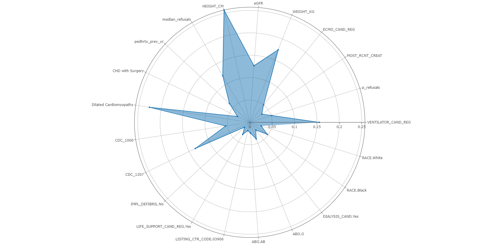
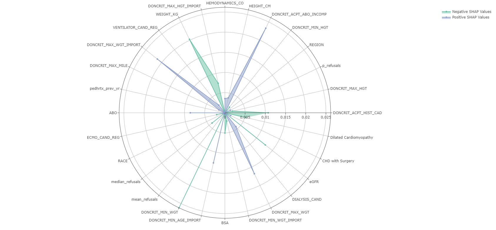

```{r load-libraries}
#| echo: true
#| warning: false
#| message: false

library(here)
library(dplyr)
library(readr)
library(magrittr)
library(spatstat)
library(tibble)
library(ggplot2)
library(purrr)
library(tidyverse)
library(huxtable)
library(reticulate)
library(DT)
library(caret)
library(glmnet)
library(forcats)
library(jsonlite)
library(quarto)

(options)(scipen=999)

```

### Survival Model Dataset

```{r load-dataset}
#| echo: true
#| warning: false
#| message: false
#| eval: true

set.seed(1997)

survival_model <- read_rds(here("data","model_data_train.rds"))

survival_model %<>%
  mutate_if(is.character, as.factor) 
 
survival_model %>% 
  str()

```

```{r}

survival_model %<>% 
  select(-median_refusals_old,-LISTING_CTR_CODE, -WL_ID_CODE, -WL_DT, -LIST_YR, -CITIZENSHIP, -starts_with("median_wait_days"))

```


```{r}

survival_model_test <- read_rds(here("data","model_data_test.rds"))

```

```{r}

survival_model_test %<>% 
  select(-median_refusals_old, -LISTING_CTR_CODE, -WL_ID_CODE, -WL_DT, -LIST_YR, -CITIZENSHIP, -starts_with("median_wait_days"))

```


```{r}

cat_features <- names(survival_model)[sapply(survival_model, is.factor)]

cat_features

```

#### Utility Function for Categorical Indexes needed by CatBoost

```{python}

def get_categorical_indexes(X_train):
    # Select columns with object or categorical dtype
    categorical_columns = X_train.select_dtypes(include=['object', 'category'])

    # Get the column indexes of categorical variables
    categorical_indexes = [X_train.columns.get_loc(col) for col in categorical_columns]

    return categorical_indexes

```

### Native CatBoost Model

```{r} 

#| echo: true
#| warning: false
#| message: false
#| eval: true

# Train
train_data <- survival_model %>% 
  select(-outcome)

# Must be factor or numeric "Class"
train_target <- survival_model %>% 
  select(outcome) %>% 
  dummify() %>% 
  as.data.frame()

train_Y <- survival_model$outcome


# Test
test_data <- survival_model_test %>% 
  select(-outcome)

# Must be factor or numeric "Class"
test_target <- survival_model_test %>% 
  select(outcome) %>% 
  dummify() %>% 
  as.data.frame()

test_Y <- survival_model_test$outcome

```


```{python catboost-r-data}

#| echo: true
#| warning: false
#| message: false

import numpy as np

# initialize Train and Test datasets
X_train = r.train_data
y_train = r.train_Y
Y_train = np.array(y_train)  

X_test = r.test_data
y_test = r.test_Y
Y_test = np.array(y_test) 

cat_index = get_categorical_indexes(X_train)

```


```{python}

import pandas as pd

# Convert NaN values to a string in categorical columns
categorical_columns = [col for col in X_train.columns if X_train[col].dtype == 'object']
X_train[categorical_columns] = X_train[categorical_columns].fillna('missing')


# Convert NaN values to a string in categorical columns
categorical_columns = [col for col in X_test.columns if X_test[col].dtype == 'object']
X_test[categorical_columns] = X_test[categorical_columns].fillna('missing')

```

- Data Cleansing for Missing Values

```{python}

# NaN values in the column at index 15
has_nan = X_train.iloc[:, 14].isna().any()
print("Column at index 14 contains NaN values:", has_nan)

```


```{python}

if 'Missing' not in X_train.iloc[:, 14].cat.categories:
    X_train.iloc[:, 14] = X_train.iloc[:, 14].cat.add_categories(['Missing'])

# Replace NaN values in the column at index 15 with "Missing"
X_train.iloc[:, 14] = X_train.iloc[:, 14].fillna('Missing')

```

#### Optuna Hyperparameter Optimization

```{python optuna-hyperparameter-optimization, eval=FALSE}

#| eval: false
#| echo: true
#| warning: false
#| message: false

import numpy as np
import pandas as pd
from sklearn.model_selection import train_test_split
import catboost as cb
from catboost import Pool
from catboost.utils import eval_metric
import optuna


def objective(trial):
    # Parameter suggestions
    params = {
        "objective": "Logloss",
        "eval_metric":"AUC",
        "iterations": 1000,
        "learning_rate": trial.suggest_float("learning_rate", 0.01, 0.3),
        "depth": trial.suggest_int("depth", 1, 9),
        "colsample_bylevel": trial.suggest_float("colsample_bylevel", 0.05, 1.0),
        "min_data_in_leaf": trial.suggest_int("min_data_in_leaf", 1, 100),
        "l2_leaf_reg": trial.suggest_float("l2_leaf_reg", 1, 12),
        "boosting_type": "Ordered",
        "bootstrap_type": "MVS",
        "verbose": 0  # Controlling verbose output
    }

    model = cb.CatBoostClassifier(**params)
    train_pool = cb.Pool(X_train, Y_train, cat_features=get_categorical_indexes(X_train))
    cv_results = cb.cv(train_pool, params, fold_count=3, seed=3590, stratified=True, verbose=False, plot=False)
    return np.max(cv_results['test-AUC-mean'])

study = optuna.create_study(direction="maximize")
study.optimize(objective, n_trials=25, timeout=6000)

print("Number of finished trials: {}".format(len(study.trials)))
print("Best trial:")
for key, value in study.best_trial.params.items():
    print("  {}: {}".format(key, value))


```


```{python optuna-params1}

model_params = {
    'learning_rate': 0.11,
    'depth': 2,
    'colsample_bylevel': 0.16,
    'min_data_in_leaf': 85,
    'l2_leaf_reg': 4.43
}
    
```

```{python catboost-model-auc}

#| eval: true
#| echo: true
#| message: false
#| warning: false

import numpy as np
from sklearn.model_selection import train_test_split, StratifiedKFold
import pandas as pd
import optuna
from catboost import CatBoostClassifier, Pool
from sklearn.metrics import confusion_matrix, precision_score, recall_score, f1_score


cat_indexes = get_categorical_indexes(X_train)

model_auc = CatBoostClassifier(iterations=1000,
                               objective='Logloss',
                               eval_metric="AUC",
                               **model_params, 
                               boosting_type= 'Ordered',
                               bootstrap_type='MVS',
                               metric_period=25,
                               early_stopping_rounds=100,
                               use_best_model=True, 
                               random_seed=1997)
                               

# Create a Pool object for the training and testing data
train_pool = Pool(X_train, cat_features=cat_indexes, label=Y_train)
test_pool = Pool(X_test, cat_features=cat_indexes, label=Y_test)
 

model_auc.fit(train_pool, eval_set=test_pool)

```
#### Model Metrics

```{python}

from sklearn.metrics import roc_auc_score, brier_score_loss, accuracy_score, log_loss
import pandas as pd

Y_Pred = model_auc.predict(X_test)

Y_Pred_Proba_Positive = model_auc.predict_proba(X_test)[:, 1]  # Probabilities of the positive class

# Calculate AUC
auc = roc_auc_score(Y_test, Y_Pred_Proba_Positive)
# Calculate Brier Score
brier_score = brier_score_loss(Y_test, Y_Pred_Proba_Positive)
# Calculate Accuracy
accuracy = accuracy_score(Y_test, Y_Pred)
# Calculate Log Loss
log_loss_value = log_loss(Y_test, Y_Pred_Proba_Positive)

# Create a DataFrame
catboost_native = pd.DataFrame({
    'Model': ['Native_Catboost'],
    'AUC': [auc],
    'Brier Score': [brier_score],
    'Accuracy': [accuracy],
    'Log Loss': [log_loss_value]
})

print(catboost_native)

```

#### Feature Importances

```{python}

gain = model_auc.get_feature_importance(prettified=True)
loss = model_auc.get_feature_importance(test_pool, type='LossFunctionChange', prettified=True)

```

```{r catboost-gain-feature-importance}

gain_tbl1 <- py$gain

gain_table1 <- tibble( 'Feature ID' = gain_tbl$`Feature Id`,
                  'Importance' = gain_tbl$Importances) %>% 
  rowid_to_column(var = "Rank") %>% 
  as_hux() %>%
  theme_article() %>% 
  set_align(col=c('Rank','Importance'), value= "center") %>% 
  set_tb_padding(2)

```


```{r catboost-loss-feature-importance}

loss_tbl1 <- py$loss

loss_table1 <- tibble( 'Feature ID' = loss_tbl$`Feature Id`,
                  'Importance' = loss_tbl$Importances) %>% 
  rowid_to_column(var = "Rank") %>% 
  as_hux() %>%
  theme_article() %>% 
  set_align(col=c('Rank','Importance'), value= "center") %>% 
  set_tb_padding(2)

```


```{r catboost-feature-importance}
#| echo: true
#| layout-ncol: 1
#| label: tbl-feature-importance-native
#| tbl-cap: "CatBoost Feature Importance"
#| tbl-subcap: 
#|   - "Gain"
#|   - "Loss Function Change"
#| warning: false
#| message: false
#| eval: true


gain_table1
loss_table1

```

### CatBoost Filtered by Feature Importances

Here we filter for features both common in Gain Feature Importances and Loss Value Function Change Feature Importances.


```{python}

import pandas as pd

# Filter the features with importance greater than zero
gain_filtered = gain[gain['Importances'] > 0]
loss_filtered = loss[loss['Importances'] > 0]

# Find the intersection of features
common_features = set(gain_filtered['Feature Id']).intersection(set(loss_filtered['Feature Id']))

# Display the common features
common_features_df = pd.DataFrame({'Feature': list(common_features)})

common_features_df

```


```{python}

import numpy as np

common_features = common_features_df['Feature'].tolist()

# Filter the train and test datasets to include only the common features
X_train_filtered = X_train[common_features]
X_test_filtered = X_test[common_features]

# Initialize Train and Test datasets
y_train = r.train_Y
Y_train = np.array(y_train)  

y_test = r.test_Y
Y_test = np.array(y_test)  

cat_index = get_categorical_indexes(X_train_filtered)

```

#### Optuna Hyperparameter Optimization

```{python optuna-hyperparameter-optimization, eval=FALSE}

#| eval: false
#| echo: true
#| warning: false
#| message: false

import numpy as np
import pandas as pd
from sklearn.model_selection import train_test_split
import catboost as cb
from catboost import Pool
from catboost.utils import eval_metric
import optuna


def objective(trial):
    # Parameter suggestions
    params = {
        "objective": "Logloss",
        "eval_metric":"AUC",
        "iterations": 1000,
        "learning_rate": trial.suggest_float("learning_rate", 0.01, 0.3),
        "depth": trial.suggest_int("depth", 1, 9),
        "colsample_bylevel": trial.suggest_float("colsample_bylevel", 0.05, 1.0),
        "min_data_in_leaf": trial.suggest_int("min_data_in_leaf", 1, 100),
        "l2_leaf_reg": trial.suggest_float("l2_leaf_reg", 1, 12),
        "boosting_type": "Ordered",
        "bootstrap_type": "MVS",
        "verbose": 0  # Controlling verbose output
    }

    model = cb.CatBoostClassifier(**params)
    train_pool = cb.Pool(X_train_filtered, Y_train, cat_features=get_categorical_indexes(X_train_filtered))
    cv_results = cb.cv(train_pool, params, fold_count=3, seed=3590, stratified=True, verbose=False, plot=False)
    return np.max(cv_results['test-AUC-mean'])

study = optuna.create_study(direction="maximize")
study.optimize(objective, n_trials=25, timeout=6000)

print("Number of finished trials: {}".format(len(study.trials)))
print("Best trial:")
for key, value in study.best_trial.params.items():
    print("  {}: {}".format(key, value))


```

```{python optuna-params2}

model_params2 = {
    'learning_rate': 0.12,
    'depth': 9,
    'colsample_bylevel': 0.11,
    'min_data_in_leaf': 2,
    'l2_leaf_reg': 8.76
}
    
```

```{python catboost-model-auc-filtered-by-feature-importance}

#| eval: true
#| echo: true
#| message: false
#| warning: false

import numpy as np
from sklearn.model_selection import train_test_split, StratifiedKFold
import pandas as pd
import optuna
from catboost import CatBoostClassifier, Pool
from sklearn.metrics import roc_auc_score, brier_score_loss, accuracy_score, log_loss, confusion_matrix


cat_indexes = get_categorical_indexes(X_train_filtered)

feature_importance_model = CatBoostClassifier(iterations=1000,
                               objective='Logloss',
                               eval_metric="AUC",
                               **model_params2, 
                               boosting_type= 'Ordered',
                               bootstrap_type='MVS',
                               metric_period=25,
                               early_stopping_rounds=100,
                               use_best_model=True, 
                               random_seed=1997)
                               

# Create a Pool object for the training and testing data
train_pool_filtered = Pool(X_train_filtered, cat_features=cat_indexes, label=Y_train)

test_pool_filtered = Pool(X_test_filtered, cat_features=cat_indexes, label=Y_test)
 

feature_importance_model.fit(train_pool_filtered, eval_set=test_pool_filtered)

```

```{python}

feature_importance_model.save_model("models/feature_importance",
           format="cbm",
           export_parameters=None,
           pool=None)


```

#### Model Metrics

```{python}

from sklearn.metrics import roc_auc_score, brier_score_loss, accuracy_score, log_loss
import pandas as pd

Y_Pred_filtered = filtered_model_auc.predict(X_test_filtered)

Y_Pred_Proba_Positive_filtered = filtered_model_auc.predict_proba(X_test_filtered)[:, 1]  # Probabilities of the positive class

# Calculate AUC
auc = roc_auc_score(Y_test, Y_Pred_Proba_Positive_filtered)
# Calculate Brier Score
brier_score = brier_score_loss(Y_test, Y_Pred_Proba_Positive_filtered)
# Calculate Accuracy
accuracy = accuracy_score(Y_test, Y_Pred_filtered)
# Calculate Log Loss
log_loss_value = log_loss(Y_test, Y_Pred_Proba_Positive_filtered)

# Create a DataFrame
filtered_by_feature_importance = pd.DataFrame({
    'Model': ['FilteredByFeatureImportance'],
    'AUC': [auc],
    'Brier Score': [brier_score],
    'Accuracy': [accuracy],
    'Log Loss': [log_loss_value]
})

print(filtered_by_feature_importance)


```

#### Feature Importances

```{python}

gain2 = filtered_model_auc.get_feature_importance(prettified=True)
loss2 = filtered_model_auc.get_feature_importance(test_pool, type='LossFunctionChange', prettified=True)

```

```{r catboost-gain-feature-importance}

gain_tbl2 <- py$gain2

gain_table2 <- tibble( 'Feature ID' = gain_tbl2$`Feature Id`,
                  'Importance' = gain_tbl2$Importances) %>% 
  rowid_to_column(var = "Rank") %>% 
  as_hux() %>%
  theme_article() %>% 
  set_align(col=c('Rank','Importance'), value= "center") %>% 
  set_tb_padding(2)

```


```{r catboost-loss-feature-importance}

loss_tbl2 <- py$loss2

loss_table2 <- tibble( 'Feature ID' = loss_tbl2$`Feature Id`,
                  'Importance' = loss_tbl2$Importances) %>% 
  rowid_to_column(var = "Rank") %>% 
  as_hux() %>%
  theme_article() %>% 
  set_align(col=c('Rank','Importance'), value= "center") %>% 
  set_tb_padding(2)

```


```{r catboost-feature-importance}
#| echo: true
#| layout-ncol: 1
#| label: tbl-feature-importance-native
#| tbl-cap: "CatBoost Feature Importance"
#| tbl-subcap: 
#|   - "Gain"
#|   - "Loss Function Change"
#| warning: false
#| message: false
#| eval: true


gain_table2
loss_table2

```


### CatBoost with One Hot Encode: Candidate Diagnosis Categorical Feature

```{r}

# converting python objects to R objects to use existing one hot encoding workflow
X_train_filtered_ohe <- py$X_train_filtered
X_test_filtered_ohe <- py$X_test_filtered

# Initialize Train and Test datasets
y_train_ohe <- py$y_train
y_test_ohe <- py$y_test


cat_features_ohe <- names(X_train_filtered_ohe)[sapply(X_train_filtered_ohe, is.factor)]

cat_features_ohe


```


```{r}

# Create the dummy variables specification
dummies <- dummyVars(~ CAND_DIAG, data = X_train_filtered_ohe[, cat_features_ohe], fullRank = FALSE)

# Generate the dummy variables
df_dummies <- predict(dummies, newdata = X_train_filtered_ohe)

# Bind the new dummy variables with the original dataframe minus the original factor columns
X_train_filtered_ohe <- cbind(X_train_filtered_ohe[, !(names(X_train_filtered_ohe) %in% c('CAND_DIAG'))], df_dummies)

# Review the structure of the updated dataframe
str(X_train_filtered_ohe)

```

```{r}

# Create the dummy variables specification
dummies <- dummyVars(~ CAND_DIAG, data = X_test_filtered_ohe[, cat_features_ohe], fullRank = FALSE)

# Generate the dummy variables
df_dummies <- predict(dummies, newdata = X_test_filtered_ohe)

# Bind the new dummy variables with the original dataframe minus the original factor columns
X_test_filtered_ohe <- cbind(X_test_filtered_ohe[, !(names(X_test_filtered_ohe) %in% c('CAND_DIAG'))], df_dummies)

# Review the structure of the updated dataframe
str(X_test_filtered_ohe)

```


```{r}

X_train_filtered_ohe %<>% 
  rename(
    `CHD with Surgery` = `CAND_DIAG.Congenital Heart Disease With Surgery`,
    `CHD without Surgery` = `CAND_DIAG.Congenital Heart Disease Without Surgery`,
    `Dilated Cardiomyopathy` = `CAND_DIAG.Dilated Cardiomyopathy`,
    `Hypertrophic Cardiomyopathy` = `CAND_DIAG.Hypertrophic Cardiomyopathy`,
    `Myocarditis` = `CAND_DIAG.Myocarditis`,
    `CD_Other` = `CAND_DIAG.Other`,
    `Restrictive Cardiomyopathy` = `CAND_DIAG.Restrictive Cardiomyopathy`,
    `Valvular Heart Disease` = `CAND_DIAG.Valvular Heart Disease`
    
  )


X_test_filtered_ohe %<>% 
  rename(
    `CHD with Surgery` = `CAND_DIAG.Congenital Heart Disease With Surgery`,
    `CHD without Surgery` = `CAND_DIAG.Congenital Heart Disease Without Surgery`,
    `Dilated Cardiomyopathy` = `CAND_DIAG.Dilated Cardiomyopathy`,
    `Hypertrophic Cardiomyopathy` = `CAND_DIAG.Hypertrophic Cardiomyopathy`,
    `Myocarditis` = `CAND_DIAG.Myocarditis`,
    `CD_Other` = `CAND_DIAG.Other`,
    `Restrictive Cardiomyopathy` = `CAND_DIAG.Restrictive Cardiomyopathy`,
    `Valvular Heart Disease` = `CAND_DIAG.Valvular Heart Disease`
    
  )

```


```{python catboost-r-data2}
#| echo: true
#| warning: false
#| message: false

import numpy as np
from catboost import Pool

# initialize data
X_train_one_hot = r.X_train_filtered_ohe
Y = np.array(r.y_train_ohe)


X_test_one_hot = r.X_test_filtered_ohe
Y_test = np.array(r.y_test_ohe)

cat_index_one_hot = get_categorical_indexes(X_train_one_hot)


```

#### Optuna Hyperparameter Optimization - One Hot Model

```{python optuna-hyperparameter-optimization-one-hot, eval=FALSE}

#| eval: false
#| echo: true
#| warning: false
#| message: false

import numpy as np
from sklearn.model_selection import train_test_split
import pandas as pd
import catboost as cb
from catboost.utils import eval_metric
import optuna


def objective(trial):
    # Parameter suggestions
    params = {
        "objective": "Logloss",
        "eval_metric":"AUC",
        "iterations": 1000,
        "learning_rate": trial.suggest_float("learning_rate", 0.01, 0.3),
        "depth": trial.suggest_int("depth", 1, 9),
        "colsample_bylevel": trial.suggest_float("colsample_bylevel", 0.05, 1.0),
        "min_data_in_leaf": trial.suggest_int("min_data_in_leaf", 1, 100),
        "l2_leaf_reg": trial.suggest_float("l2_leaf_reg", 1, 12),
        "boosting_type": "Ordered",
        "bootstrap_type": "MVS",
        "early_stopping_rounds": 100
    }

    model = cb.CatBoostClassifier(**params)
    train_pool = cb.Pool(X_train_one_hot, Y, cat_features=get_categorical_indexes(X_train_one_hot))
    cv_results = cb.cv(train_pool, params, fold_count=3, seed=3590, stratified=True, verbose=False)
    return np.max(cv_results['test-AUC-mean'])

study = optuna.create_study(direction="maximize")
study.optimize(objective, n_trials=25, timeout=6000)

print("Number of finished trials: {}".format(len(study.trials)))
print("Best trial:")
for key, value in study.best_trial.params.items():
    print("  {}: {}".format(key, value))


```

- From Optuna Trial #1/25 with value: 0.739

```{python optuna-params3}

model_params3 = {
    'learning_rate': 0.17,
    'depth': 6,
    'colsample_bylevel': 0.13,
    'min_data_in_leaf': 30,
    'l2_leaf_reg': 10.54
}
    
```

```{python catboost-model-one-hot-encoding}

#| eval: true
#| echo: true
#| message: false
#| warning: false

from sklearn.model_selection import train_test_split
from catboost import CatBoostClassifier, Pool


filtered_model_one_hot = CatBoostClassifier(iterations=8000,
                               objective='Logloss',
                               eval_metric='AUC',
                               **model_params3, 
                               boosting_type= 'Ordered',
                               metric_period=500,
                               bootstrap_type='MVS',
                               early_stopping_rounds=100,
                               use_best_model=True, 
                               random_seed=1997)
                               

# Create a Pool object for the training and testing data
train_pool = Pool(X_train_one_hot, Y, cat_features=get_categorical_indexes(X_train_one_hot))
test_pool = Pool(X_test_one_hot, Y_test, cat_features=get_categorical_indexes(X_train_one_hot))
 

filtered_model_one_hot.fit(train_pool, eval_set=test_pool)

gain_one_hot = filtered_model_one_hot.get_feature_importance(prettified=True)
loss_one_hot = filtered_model_one_hot.get_feature_importance(test_pool, type='LossFunctionChange', prettified=True)

```

#### Feature Importances: Candidate Diagnosis One Hot Encoding

```{r feature-importance-one-hot}
#| echo: true
#| layout-ncol: 1
#| label: tbl-feature-importance-one-hot
#| tbl-cap: "CatBoost Feature Importance with One-Hot Encoding"
#| tbl-subcap: 
#|   - "Gain"
#|   - "Loss Function Change"
#| warning: false
#| message: false
#| eval: true

gain_tbl_ohe <- py$gain_one_hot
loss_tbl_ohe <- py$loss_one_hot

gain_table_ohe <- tibble( 'Feature ID' = gain_tbl_ohe$`Feature Id`,
                  'Importance' = gain_tbl_ohe$Importances) %>% 
  rowid_to_column(var = "Rank") %>% 
  as_hux() %>%
  theme_article() %>% 
  set_align(col=c('Rank','Importance'), value= "center") %>% 
  set_tb_padding(2)


loss_table_ohe <- tibble( 'Feature ID' = loss_tbl_ohe$`Feature Id`,
                  'Importance' = loss_tbl_ohe$Importances) %>% 
  rowid_to_column(var = "Rank") %>% 
  as_hux() %>%
  theme_article() %>% 
  set_align(col=c('Rank','Importance'), value= "center") %>% 
  set_tb_padding(2)

gain_table_ohe
loss_table_ohe

```

#### Model Metrics

```{python}

from sklearn.metrics import roc_auc_score, brier_score_loss, accuracy_score, log_loss
import pandas as pd

Y_Pred = filtered_model_one_hot.predict(X_test_one_hot)

Y_Pred_Proba_Positive = filtered_model_one_hot.predict_proba(X_test_one_hot)[:, 1]  # Probabilities of the positive class

# Calculate AUC
auc = roc_auc_score(Y_test, Y_Pred_Proba_Positive)
# Calculate Brier Score
brier_score = brier_score_loss(Y_test, Y_Pred_Proba_Positive)
# Calculate Accuracy
accuracy = accuracy_score(Y_test, Y_Pred)
# Calculate Log Loss
log_loss_value = log_loss(Y_test, Y_Pred_Proba_Positive)

# Create a DataFrame
candidate_diagnosis_one_hot = pd.DataFrame({
    'Model': ['CandidateDiagnosisOneHot'],
    'AUC': [auc],
    'Brier Score': [brier_score],
    'Accuracy': [accuracy],
    'Log Loss': [log_loss_value]
})

print(candidate_diagnosis_one_hot)


```


### CatBoost One Hot Encoding: All

```{r}

cat_features_ohe <- names(X_train_filtered_ohe)[sapply(X_train_filtered_ohe, is.factor)]

cat_features_ohe

```


```{r}

# Create the dummy variables specification for all categorical features
dummies <- dummyVars(~ ., data = X_train_filtered_ohe[, cat_features_ohe], fullRank = FALSE)

# Generate the dummy variables
df_dummies <- predict(dummies, newdata = X_train_filtered_ohe[, cat_features_ohe])

# Bind the new dummy variables with the original dataframe minus the original categorical columns
X_train_filtered_ohe <- cbind(X_train_filtered_ohe[, !(names(X_train_filtered_ohe) %in% cat_features_ohe)], df_dummies)

# Review the structure of the updated dataframe
colnames(X_train_filtered_ohe)

```


```{r}

# Create the dummy variables specification for all categorical features
dummies <- dummyVars(~ ., data = X_test_filtered_ohe[, cat_features_ohe], fullRank = FALSE)

# Generate the dummy variables
df_dummies <- predict(dummies, newdata = X_test_filtered_ohe[, cat_features_ohe])

# Bind the new dummy variables with the original dataframe minus the original categorical columns
X_test_filtered_ohe <- cbind(X_test_filtered_ohe[, !(names(X_test_filtered_ohe) %in% cat_features_ohe)], df_dummies)

# Review the structure of the updated dataframe
colnames(X_test_filtered_ohe)

```


```{r}

X_train_filtered_ohe %<>% 
  select(-VAD_DEVICE_TY_TCR.Missing)

colnames(X_train_filtered_ohe)

```


```{r}

# Rename columns in the training dataset
X_train_filtered_ohe %<>% 
  rename(
    CDL_CHD_With_Surgery = `CAND_DIAG_LISTING.Congenital Heart Disease With Surgery`,
    CDL_CHD_Without_Surgery = `CAND_DIAG_LISTING.Congenital Heart Disease Without Surgery`,
    CDL_Dilated_Cardiomyopathy = `CAND_DIAG_LISTING.Dilated Cardiomyopathy`,
    CDL_Hypertrophic_Cardiomyopathy = `CAND_DIAG_LISTING.Hypertrophic Cardiomyopathy`,
    CDL_Myocarditis = `CAND_DIAG_LISTING.Myocarditis`,
    CDL_Other = `CAND_DIAG_LISTING.Other`,
    CDL_Restrictive_Cardiomyopathy = `CAND_DIAG_LISTING.Restrictive Cardiomyopathy`,
    CDL_Valvular_Heart_Disease = `CAND_DIAG_LISTING.Valvular Heart Disease`,
    CDC_1000 = `CAND_DIAG_CODE.1000: Dilated Cardiomyopathy`,
    CDC_1001 = `CAND_DIAG_CODE.1001: Dilated Cardiomyopathy`,
    CDC_1002 = `CAND_DIAG_CODE.1002: Dilated Cardiomyopathy`,
    CDC_1003 = `CAND_DIAG_CODE.1003: Dilated Cardiomyopathy`,
    CDC_1004 = `CAND_DIAG_CODE.1004: Myocarditis`,
    CDC_1005 = `CAND_DIAG_CODE.1005: Dilated Cardiomyopathy`,
    CDC_1006 = `CAND_DIAG_CODE.1006: Myocarditis`,
    CDC_1007 = `CAND_DIAG_CODE.1007: Dilated Cardiomyopathy`,
    CDC_1008 = `CAND_DIAG_CODE.1008: Other`,
    CDC_1010 = `CAND_DIAG_CODE.1010: Other`,
    CDC_1049 = `CAND_DIAG_CODE.1049: Dilated Cardiomyopathy`,
    CDC_1050 = `CAND_DIAG_CODE.1050: Restrictive Cardiomyopathy`,
    CDC_1052 = `CAND_DIAG_CODE.1052: Restrictive Cardiomyopathy`,
    CDC_1054 = `CAND_DIAG_CODE.1054: Restrictive Cardiomyopathy`,
    CDC_1099 = `CAND_DIAG_CODE.1099: Restrictive Cardiomyopathy`,
    CDC_1200 = `CAND_DIAG_CODE.1200: Other`,
    CDC_1201 = `CAND_DIAG_CODE.1201: Hypertrophic Cardiomyopathy`,
    CDC_1202 = `CAND_DIAG_CODE.1202: Valvular Heart Disease`,
    CDC_1203 = `CAND_DIAG_CODE.1203: Other`,
    CDC_1204 = `CAND_DIAG_CODE.1204: Other`,
    CDC_1205 = `CAND_DIAG_CODE.1205: Congenital Heart Disease Without Surgery`,
    CDC_1206 = `CAND_DIAG_CODE.1206: Congenital Heart Disease Without Surgery`,
    CDC_1207 = `CAND_DIAG_CODE.1207: Congenital Heart Disease With Surgery`,
    CDC_1208 = `CAND_DIAG_CODE.1208: Other`,
    CDC_1209 = `CAND_DIAG_CODE.1209: Dilated Cardiomyopathy`,
    CDC_999_Other = `CAND_DIAG_CODE.999: Other`,
    CDC_999_Dilated_Cardiomyopathy = `CAND_DIAG_CODE.999: Dilated Cardiomyopathy`
  )

# Rename columns in the test dataset
X_test_filtered_ohe %<>% 
  rename(
    CDL_CHD_With_Surgery = `CAND_DIAG_LISTING.Congenital Heart Disease With Surgery`,
    CDL_CHD_Without_Surgery = `CAND_DIAG_LISTING.Congenital Heart Disease Without Surgery`,
    CDL_Dilated_Cardiomyopathy = `CAND_DIAG_LISTING.Dilated Cardiomyopathy`,
    CDL_Hypertrophic_Cardiomyopathy = `CAND_DIAG_LISTING.Hypertrophic Cardiomyopathy`,
    CDL_Myocarditis = `CAND_DIAG_LISTING.Myocarditis`,
    CDL_Other = `CAND_DIAG_LISTING.Other`,
    CDL_Restrictive_Cardiomyopathy = `CAND_DIAG_LISTING.Restrictive Cardiomyopathy`,
    CDL_Valvular_Heart_Disease = `CAND_DIAG_LISTING.Valvular Heart Disease`,
    CDC_1000 = `CAND_DIAG_CODE.1000: Dilated Cardiomyopathy`,
    CDC_1001 = `CAND_DIAG_CODE.1001: Dilated Cardiomyopathy`,
    CDC_1002 = `CAND_DIAG_CODE.1002: Dilated Cardiomyopathy`,
    CDC_1003 = `CAND_DIAG_CODE.1003: Dilated Cardiomyopathy`,
    CDC_1004 = `CAND_DIAG_CODE.1004: Myocarditis`,
    CDC_1005 = `CAND_DIAG_CODE.1005: Dilated Cardiomyopathy`,
    CDC_1006 = `CAND_DIAG_CODE.1006: Myocarditis`,
    CDC_1007 = `CAND_DIAG_CODE.1007: Dilated Cardiomyopathy`,
    CDC_1008 = `CAND_DIAG_CODE.1008: Other`,
    CDC_1010 = `CAND_DIAG_CODE.1010: Other`,
    CDC_1049 = `CAND_DIAG_CODE.1049: Dilated Cardiomyopathy`,
    CDC_1050 = `CAND_DIAG_CODE.1050: Restrictive Cardiomyopathy`,
    CDC_1052 = `CAND_DIAG_CODE.1052: Restrictive Cardiomyopathy`,
    CDC_1054 = `CAND_DIAG_CODE.1054: Restrictive Cardiomyopathy`,
    CDC_1099 = `CAND_DIAG_CODE.1099: Restrictive Cardiomyopathy`,
    CDC_1200 = `CAND_DIAG_CODE.1200: Other`,
    CDC_1201 = `CAND_DIAG_CODE.1201: Hypertrophic Cardiomyopathy`,
    CDC_1202 = `CAND_DIAG_CODE.1202: Valvular Heart Disease`,
    CDC_1203 = `CAND_DIAG_CODE.1203: Other`,
    CDC_1204 = `CAND_DIAG_CODE.1204: Other`,
    CDC_1205 = `CAND_DIAG_CODE.1205: Congenital Heart Disease Without Surgery`,
    CDC_1206 = `CAND_DIAG_CODE.1206: Congenital Heart Disease Without Surgery`,
    CDC_1207 = `CAND_DIAG_CODE.1207: Congenital Heart Disease With Surgery`,
    CDC_1208 = `CAND_DIAG_CODE.1208: Other`,
    CDC_1209 = `CAND_DIAG_CODE.1209: Dilated Cardiomyopathy`,
    CDC_999_Other = `CAND_DIAG_CODE.999: Other`,
    CDC_999_Dilated_Cardiomyopathy = `CAND_DIAG_CODE.999: Dilated Cardiomyopathy`
  )

# Review the structure of the updated dataframes
str(X_train_filtered_ohe)

```

```{python}
#| echo: true
#| warning: false
#| message: false

import numpy as np
from catboost import Pool

# initialize data
X_train_one_hot_all = r.X_train_filtered_ohe
Y = np.array(r.y_train_ohe)


X_test_one_hot_all = r.X_test_filtered_ohe
Y_test = np.array(r.y_test_ohe)

```

#### Optuna Hyperparameter Optimization - One Hot Encoding All Model

```{python optuna-hyperparameter-optimization-one-hot, eval=FALSE}

#| eval: false
#| echo: true
#| warning: false
#| message: false

import numpy as np
from sklearn.model_selection import train_test_split
import pandas as pd
import catboost as cb
from catboost.utils import eval_metric
import optuna


def objective(trial):
    # Parameter suggestions
    params = {
        "objective": "Logloss",
        "eval_metric":"AUC",
        "iterations": 1000,
        "learning_rate": trial.suggest_float("learning_rate", 0.01, 0.3),
        "depth": trial.suggest_int("depth", 1, 9),
        "colsample_bylevel": trial.suggest_float("colsample_bylevel", 0.05, 1.0),
        "min_data_in_leaf": trial.suggest_int("min_data_in_leaf", 1, 100),
        "l2_leaf_reg": trial.suggest_float("l2_leaf_reg", 1, 12),
        "boosting_type": "Ordered",
        "bootstrap_type": "MVS",
        "early_stopping_rounds": 100
    }

    model = cb.CatBoostClassifier(**params)
    train_pool = cb.Pool(X_train_one_hot_all, Y)
    cv_results = cb.cv(train_pool, params, fold_count=3, seed=3590, stratified=True, verbose=False)
    return np.max(cv_results['test-AUC-mean'])

study = optuna.create_study(direction="maximize")
study.optimize(objective, n_trials=25, timeout=6000)

print("Number of finished trials: {}".format(len(study.trials)))
print("Best trial:")
for key, value in study.best_trial.params.items():
    print("  {}: {}".format(key, value))


```


```{python optuna-params4}

model_params4 = {
    'learning_rate': 0.02,
    'depth': 3,
    'colsample_bylevel': 0.59,
    'min_data_in_leaf': 17,
    'l2_leaf_reg': 10.52
}
    
```


```{python catboost-model-one-hot-encoding}

#| eval: true
#| echo: true
#| message: false
#| warning: false

from sklearn.model_selection import train_test_split
from catboost import CatBoostClassifier, Pool


filtered_one_hot_all = CatBoostClassifier(iterations=8000,
                               objective='Logloss',
                               eval_metric='AUC',
                               **model_params4, 
                               boosting_type= 'Ordered',
                               metric_period=500,
                               bootstrap_type='MVS',
                               early_stopping_rounds=100,
                               use_best_model=True, 
                               random_seed=1997)
                               

# Create a Pool object for the training and testing data
train_pool = Pool(X_train_one_hot_all, Y)
test_pool = Pool(X_test_one_hot_all, Y_test)
 

filtered_one_hot_all.fit(train_pool, eval_set=test_pool)

gain_one_hot_all = filtered_one_hot_all.get_feature_importance(prettified=True)
loss_one_hot_all = filtered_one_hot_all.get_feature_importance(test_pool, type='LossFunctionChange', prettified=True)

```
#### Feature Importances: One Hot Encoding All

```{r feature-importance-one-hot}
#| echo: true
#| layout-ncol: 1
#| label: tbl-feature-importance-one-hot
#| tbl-cap: "CatBoost Feature Importance with One-Hot Encoding"
#| tbl-subcap: 
#|   - "Gain"
#|   - "Loss Function Change"
#| warning: false
#| message: false
#| eval: true

gain_tbl_ohe_all <- py$gain_one_hot_all
loss_tbl_ohe_all <- py$loss_one_hot_all

gain_table_ohe_all <- tibble( 'Feature ID' = gain_tbl_ohe_all$`Feature Id`,
                  'Importance' = gain_tbl_ohe_all$Importances) %>% 
  rowid_to_column(var = "Rank") %>% 
  as_hux() %>%
  theme_article() %>% 
  set_align(col=c('Rank','Importance'), value= "center") %>% 
  set_tb_padding(2)


loss_table_ohe_all <- tibble( 'Feature ID' = loss_tbl_ohe_all$`Feature Id`,
                  'Importance' = loss_tbl_ohe_all$Importances) %>% 
  rowid_to_column(var = "Rank") %>% 
  as_hux() %>%
  theme_article() %>% 
  set_align(col=c('Rank','Importance'), value= "center") %>% 
  set_tb_padding(2)

gain_table_ohe_all
loss_table_ohe_all

```

#### Model Metrics

```{python}

from sklearn.metrics import roc_auc_score, brier_score_loss, accuracy_score, log_loss
import pandas as pd

Y_Pred_OHE_All = filtered_one_hot_all.predict(X_test_one_hot_all)

Y_Pred_Proba_Positive_OHE_All = filtered_one_hot_all.predict_proba(X_test_one_hot_all)[:, 1]  # Probabilities of the positive class

# Calculate AUC
auc = roc_auc_score(Y_test, Y_Pred_Proba_Positive_OHE_All)
# Calculate Brier Score
brier_score = brier_score_loss(Y_test, Y_Pred_Proba_Positive_OHE_All)
# Calculate Accuracy
accuracy = accuracy_score(Y_test, Y_Pred_OHE_All)
# Calculate Log Loss
log_loss_value = log_loss(Y_test, Y_Pred_Proba_Positive_OHE_All)

# Create a DataFrame
catboost_one_hot_all = pd.DataFrame({
    'Model': ['Catboost_OHE_All'],
    'AUC': [auc],
    'Brier Score': [brier_score],
    'Accuracy': [accuracy],
    'Log Loss': [log_loss_value]
})

print(catboost_one_hot_all)


```

### XGBoost


#### Optuna Hyperparameter Optimization

```{r}

library(reticulate)
library(parsnip)
library(dplyr)
library(yardstick)

# Import Optuna from Python
optuna <- import("optuna")

# Combine features and labels into training and testing dataframes
model_train <- cbind(X_train_filtered_ohe, Outcome = as.factor(Y_train_ohe))
model_test <- cbind(X_test_filtered_ohe, Outcome = as.factor(Y_test_ohe))

# Define the objective function
objective <- function(trial) {
  # Define the hyperparameters you want to tune
  trees <- trial$suggest_int("trees", 100, 1000)
  tree_depth <- trial$suggest_int("tree_depth", 1, 12)
  learn_rate <- trial$suggest_loguniform("learn_rate", 0.01, 0.1)
  min_n <- trial$suggest_int("min_n", 1, 10)
  sample_size <- trial$suggest_uniform("sample_size", 0.5, 1.0)
  mtry <- trial$suggest_int("mtry", 1, 10)
  
  # Define the XGBoost model specification with the suggested hyperparameters
  xgb_spec <- boost_tree(
    trees = trees,
    tree_depth = tree_depth,
    learn_rate = learn_rate,
    min_n = min_n,
    sample_size = sample_size,
    mtry = mtry,
    engine = "xgboost"
  ) %>%
    set_mode("classification")
  
  # Fit the model on training data
  xgb_fit <- fit(
    xgb_spec,
    Outcome ~ .,
    data = model_train
  )
  
  # Make predictions on the validation set
  predictions <- predict(xgb_fit, new_data = model_test, type = "prob") %>%
    bind_cols(predict(xgb_fit, new_data = model_test, type = "class")) %>%
    dplyr::mutate(truth = model_test$Outcome)
  
  # Check the structure of the predictions dataframe
  print(str(predictions))
  
  # Calculate the evaluation metric (e.g., log loss)
  log_loss <- mn_log_loss(predictions, truth = truth, .pred_1)
  
  # Return the metric value as a numeric
  return(log_loss$.estimate)
}

# Create an Optuna study
study <- optuna$create_study(direction = "minimize")

# Optimize the study
study$optimize(objective, n_trials = 500)

# Get the best hyperparameters
best_params <- study$best_params
print(best_params)

```

Best is trial #331/500 with value: 1.196 for log loss

$trees
[1] 100

$tree_depth
[1] 12

$learn_rate
[1] 0.01

$min_n
[1] 1

$sample_size
[1] 0.958

$mtry
[1] 10


```{r}

# Load required libraries
library(parsnip)
library(dplyr)
library(yardstick)


# XGBoost model specification
xgb_spec <- boost_tree(
  trees = 100,
  tree_depth = 12,
  min_n = 1,
  loss_reduction = 0.01,
  sample_size = 0.72,
  mtry = 10,
  learn_rate = 0.01,
  engine = "xgboost"
) %>%
  set_mode("classification")

# Fit the model
xgb_fit <- fit(
  xgb_spec,
  Outcome ~ .,
  data = model_train
)

# Make predictions on the test data
predictions <- predict(xgb_fit, new_data = model_test, type = "prob") %>%
  bind_cols(predict(xgb_fit, new_data = model_test)) %>%
  dplyr::mutate(truth = model_test$Outcome)
```

#### Model Metrics

```{r}
# Evaluate the model performance
accuracy <- predictions %>%
  metrics(truth = truth, estimate = .pred_class) %>%
  filter(.metric == "accuracy") %>%
  pull(.estimate)

brier_score <- mean((predictions$.pred_1 - as.numeric(predictions$truth) - 1) ^ 2)

roc_auc <- predictions %>%
  roc_auc(truth = truth, .pred_1) %>%
  pull(.estimate)

log_loss <- predictions %>%
  mn_log_loss(truth = truth, .pred_1) %>%
  pull(.estimate)

cat("Accuracy:", accuracy, "\n")
cat("Brier Score:", brier_score, "\n")
cat("ROC AUC:", roc_auc, "\n")
cat("Log Loss:", log_loss, "\n")

```


### Random Forest


#### Optuna Hyperparameter Optimization


```{r}

# Function to summarize missing data
summarize_missing_data <- function(data) {
  data %>%
    summarise_all(~ sum(is.na(.))) %>%
    gather(key = "column", value = "num_missing") %>%
    filter(num_missing > 0) %>%
    arrange(desc(num_missing))
}

# Summarize missing data in training and testing dataframes
missing_train <- summarize_missing_data(model_train)
missing_test <- summarize_missing_data(model_test)

print("Missing data in training set:")
print(missing_train)

print("Missing data in testing set:")
print(missing_test)

```


```{r}

# Drop columns with more than 500 missing values
columns_to_drop <- missing_train %>%
  filter(num_missing > 500) %>%
  pull(column)

model_train <- model_train %>%
  select(-one_of(columns_to_drop))

model_test <- model_test %>%
  select(-one_of(columns_to_drop))

# Verify columns are dropped
print("Columns dropped from training and testing sets:")
print(columns_to_drop)

```
```{r}

# Drop rows with any remaining missing values in training and testing sets
model_train <- model_train %>%
  drop_na()

model_test <- model_test %>%
  drop_na()

# Verify there are no more missing values
print("Missing data after dropping rows:")
print(summarize_missing_data(model_train))
print(summarize_missing_data(model_test))

```


```{r}

library(reticulate)
library(parsnip)
library(dplyr)
library(yardstick)

# Import Optuna from Python
optuna <- import("optuna")

# Define the objective function
objective <- function(trial) {
  # Define the hyperparameters you want to tune
  trees <- trial$suggest_int("trees", 100, 1000)
  min_n <- trial$suggest_int("min_n", 1, 10)
  mtry <- trial$suggest_int("mtry", 1, 10)
  
  # Define the XGBoost model specification with the suggested hyperparameters
  rf_spec <- rand_forest(
    trees = trees,
    min_n = min_n,
    mtry = mtry,
    engine = "randomForest"
  ) %>%
    set_mode("classification")
  
  # Fit the model on training data
  rf_fit <- fit(
    rf_spec,
    Outcome ~ .,
    data = model_train
  )
  
  # Make predictions on the validation set
  predictions <- predict(rf_fit, new_data = model_test, type = "prob") %>%
    bind_cols(predict(rf_fit, new_data = model_test, type = "class")) %>%
    dplyr::mutate(truth = model_test$Outcome)
  
  # Check the structure of the predictions dataframe
  print(str(predictions))

# Calculate the evaluation metric (e.g., log loss)
  log_loss <- mn_log_loss(predictions, truth = truth, .pred_1)
  
  # Return the metric value as a numeric
  return(log_loss$.estimate)
}

# Create an Optuna study
study <- optuna$create_study(direction = "minimize")

# Optimize the study
study$optimize(objective, n_trials = 500)

# Get the best hyperparameters
best_params <- study$best_params
print(best_params)


```

Best is trial #247/500 with value: 2.73.
$trees
[1] 766

$min_n
[1] 1

$mtry
[1] 10


```{r}

# Fit the final model with the best hyperparameters
final_rf_spec <- rand_forest(
  trees = best_params$trees,
  min_n = best_params$min_n,
  mtry = best_params$mtry
) %>%
  set_engine("randomForest") %>%
  set_mode("classification")

final_rf_fit <- fit(
  final_rf_spec,
  Outcome ~ .,
  data = model_train
)

# Predict on the test set
test_predictions <- predict(final_rf_fit, new_data = model_test, type = "prob") %>%
  bind_cols(predict(final_rf_fit, new_data = model_test)) %>%
  dplyr::mutate(truth = model_test$Outcome)
```

#### Model Metrics

```{r}
# Evaluate the model performance
accuracy <- test_predictions %>%
  metrics(truth = truth, estimate = .pred_class) %>%
  filter(.metric == "accuracy") %>%
  pull(.estimate)

brier_score <- mean((test_predictions$.pred_1 - as.numeric(test_predictions$truth) - 1) ^ 2)

roc_auc <- test_predictions %>%
  roc_auc(truth = truth, .pred_1) %>%
  pull(.estimate)

log_loss <- test_predictions %>%
  mn_log_loss(truth = truth, .pred_1) %>%
  pull(.estimate)

cat("Accuracy:", accuracy, "\n")
cat("Brier Score:", brier_score, "\n")
cat("ROC AUC:", roc_auc, "\n")
cat("Log Loss:", log_loss, "\n")


```

### SHAP Value Analysis for Best Model

```{python shap-setup}

#| eval: false
#| echo: true
#| message: false
#| warning: false

import shap

explainer = shap.TreeExplainer(filtered_one_hot_all)
shap_values = explainer(X_train_one_hot_all)
    
```

#### Beeswarm (Top Features - Categorical and Numerical)

```{python}

mean_abs_shap_values = np.mean(np.abs(shap_values.values), axis=0)

top_n = 20
top_indices = np.argsort(-mean_abs_shap_values)[:top_n]  # Indices of the top features

filtered_shap_values = shap_values[:, top_indices]

```

```{python shap-setup2}
#| eval: false
#| echo: true
#| message: false
#| warning: false

plt.close()

import matplotlib.pyplot as plt
import shap

shap.initjs()


shap.plots.beeswarm(filtered_shap_values,20)

plt.xlabel('', fontsize=8)
plt.ylabel('', fontsize=8)
plt.title('', fontsize=8)
plt.tight_layout()

plt.savefig('images/shapley_beeswarm.png', dpi=1200)

```

{#fig-shap-beeswarm-chart}

#### Bar Chart for Feature Importance

```{python shapley-bar-chart}
#| eval: false
#| echo: true
#| warning: false
#| message: false
#| label: fig-net-effect
#| fig-cap: 
#|   - "Net Effect"

import matplotlib.pyplot as plt
import shap

shap.initjs()

plt.close()
plt.close()

shap.plots.bar(filtered_shap_values, max_display=20)

plt.tight_layout()

# Save the image in high resolution
plt.savefig('images/shapley_bar_one_hot.png', dpi=1200)

```

{#fig-shap-numerical-beeswarm-chart}

```{r}
#| eval: false
#| echo: true
#| warning: false
#| message: false

# Numeric Column Indexes
numeric_column_indexes <- which(sapply(one_hot_train_data , is.numeric))

# Convert to Python index format (zero-based)
python_numeric_column_indexes <- numeric_column_indexes - 1

# Factor Column Names
factor_column_names <- names(one_hot_train_data)[sapply(one_hot_train_data, is.factor)]

# Numeric Column Names
numeric_column_names <- names(one_hot_train_data)[sapply(one_hot_train_data, is.numeric)]


```

#### Beeswarm Top Numerical Features

```{python beeswarm-numerical-features}
#| eval: false
#| echo: true
#| warning: false
#| message: false
#| out-width: 70%
#| out-height: 70%
#| fig-cap: 
#|   - "Beeswarm Numerical Effects"

import matplotlib.pyplot as plt
import shap
import pickle

shap.initjs()

plt.close()
plt.close()

num_features = r.numeric_column_names

# Subset the SHAP values to only include the numerical features
numerical_shap_values = shap_values[:, num_features]

# Plot the beeswarm for only the numerical features
shap.plots.beeswarm(numerical_shap_values,20)

plt.tight_layout()

# Save the figure with desired DPI
plt.savefig('images/shapley_beeswarm_numerical.png', dpi=1200, bbox_inches="tight")

```

{#fig-shap-numerical-beeswarm-chart}

#### SHAP Value Feature Importance Correlation Plot

```{python correlation-plot}
#| eval: false
#| echo: true
#| warning: false
#| message: false
#| out-width: 70%
#| out-height: 70%
#| fig-cap: 
#|   - "SHAP Value Correlation Plot"

plt.close()

import seaborn as sns
import matplotlib.pyplot as plt

# SHAP correlation plot
corr_matrix = pd.DataFrame(numerical_shap_values.values, columns=num_features).corr()

sns.set(font_scale=.2)
sns.heatmap(corr_matrix,cmap="coolwarm", center=0, annot=True, fmt =".1g")

plt.tight_layout()

# Save the figure with desired DPI
plt.savefig('images/shap_correlation_plot.png', dpi=1200, bbox_inches="tight")

```

{#fig-shap-correlation-plot}

#### SHAP Value Feature Importance - Mean Absolute Value

```{r shap-values, eval=FALSE}

# SHAP values
shap_values <- py$shap_values

# Extract SHAP values for each feature (excluding the last column which is the expected value)
shap_values_matrix <- shap_values$values

# Convert SHAP values to a dataframe for easier analysis
shap_df <- as.data.frame(shap_values_matrix)
names(shap_df) <- shap_values$feature_names

```

```{r mean-absolute-shap-values, eval=FALSE}

features <- names(one_hot_train_data)

mean_abs_shap_values <- colMeans(abs(shap_df))  # Compute mean absolute SHAP values

```

```{r radar-chart, eval=FALSE}

library(plotly)

# Function to generate plot based on a threshold
generate_radar_plot <- function(threshold) {
  indices <- which(mean_abs_shap_values > threshold)
  data <- data.frame(
    r = mean_abs_shap_values[indices],
    theta = features[indices]
  )

  p <- plot_ly(data, type = 'scatterpolar', fill = 'toself',
               r = ~r, theta = ~theta, mode = 'lines+markers',
               marker = list(size = 5)) %>%
    layout(
      polar = list(
        radialaxis = list(
          visible = T,
          range = c(0, max(data$r))
        )
      )
    )
  return(p)
}

# Plot
threshold <- .025
plot <- generate_radar_plot(threshold)


# Print the plot
plot

```
{#fig-shap-radar-chart}

#### SHAP Value Radar Chart Feature Importance - Mean Positive and Mean Negative Values 

Negative SHAP values in a binary classification where "1" is positive indicate that the feature decreases the probability of the positive outcome. 

Low values for Median # Refusals and low values for Median Wait Days - pushes prediction to the '0' class - 'Survival'.

This visualization represents the positive and negative values for the 'Positive' Class ('1'). For situations that are based on both clasess (ie. One hot encoded values where SHAP value refers to the presence or absence of value) a Beeswarm chart is more appropriate. (See Dilated Cardiomyopathy for example - high positive SHAP value for absence of feature)


```{r pos-neg-shap-values, eval=FALSE}

# Model Features
features <- names(shap_df)

# Mean SHAP values for each feature
mean_shap_values <- colMeans(shap_df)

# Separate positive and negative SHAP values
positive_shap_values <- mean_shap_values
negative_shap_values <- mean_shap_values

positive_shap_values[positive_shap_values < 0] <- 0
negative_shap_values[negative_shap_values > 0] <- 0

# Make negative SHAP values positive for visualization purposes
negative_shap_values <- abs(negative_shap_values)

```

```{r radar-chart-positive-negative, eval=FALSE}

library(plotly)

# Function to generate radar plot with positive and negative SHAP values
generate_radar_plot_pos_neg <- function(threshold) {
  # Filter features based on the threshold for mean absolute SHAP values
  indices <- which(colMeans(abs(shap_df)) > threshold)
  
  # Prepare data for plotly
  data_positive <- data.frame(
    r = positive_shap_values[indices],
    theta = features[indices],
    group = "Positive SHAP Values"
  )
  
  data_negative <- data.frame(
    r = negative_shap_values[indices],
    theta = features[indices],
    group = "Negative SHAP Values"
  )
  
  # Combine the data
  data_plot <- rbind(data_positive, data_negative)
  
  # Create the radar plot
  p <- plot_ly(data_plot, type = 'scatterpolar', fill = 'toself',
               r = ~r, theta = ~theta, color = ~group,
               mode = 'lines+markers',
               marker = list(size = 5)) %>%
    layout(
      polar = list(
        radialaxis = list(
          visible = TRUE,
          range = c(0, max(data_plot$r))
        )
      )
    )
  return(p)
}

# Define a threshold for SHAP value significance
threshold <- 0.025

# Generate and print the plot
plot <- generate_radar_plot_pos_neg(threshold)
plot

```
{#fig-shap-radar-chart-positive-negative}
